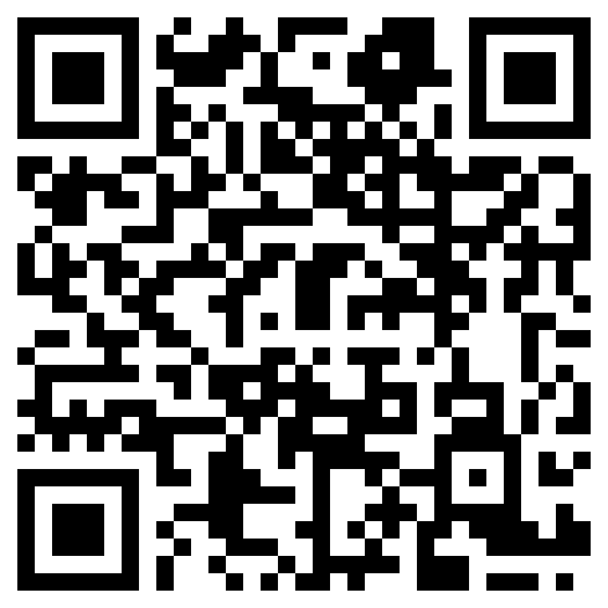

# Bars_and_Codes

## 题目简述

题目把二维码与音频频谱串成两层载荷。二维码本身不是最终答案，而是指向随题提供的 `audio.wav`；音频直接播放没有可理解内容，真正的信息位于频谱图中。

## 解题过程

先扫描二维码：



二维码得到的链接对应仓库中的 `audio.wav`。在 Audacity 或 Sonic Visualiser 中切换到频谱视图，适当增大 FFT 窗口并调整动态范围，可以直接看到由频率能量绘出的文字。转写并补上 flag 外壳后得到：

```text
n00bz{sp3ct09r4m5_4r3_c00l3r_th4n_b4rc0d35}
```

## 方法总结

二维码只解决了载荷定位，音频听感异常才是继续检查时频域的信号。多层隐写题应在每一层验证文件类型和语义，不要在拿到一个可访问链接后就停止。
