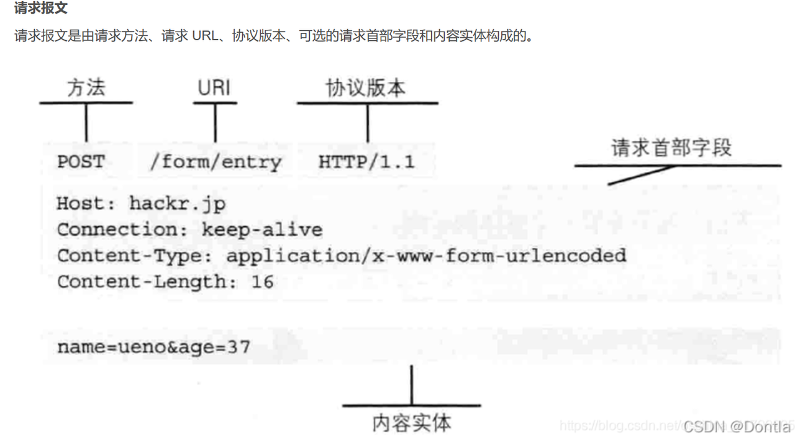

# hello_http

## 题目简述

题目通过一组顺序执行的 PHP 条件判断检查 HTTP 请求。请求必须同时满足指定的 `User-Agent`、GET 参数、POST 表单、Cookie、`Referer` 和 `X-Forwarded-For`；每通过一项检查，服务端就输出一段 flag，因此目标是构造一份完整请求，而不是寻找漏洞。

源码中的关键约束为：

```text
User-Agent: x1cBrowser
GET hello=world
POST web=security
Cookie flag=secret
Referer: http://localhost:8080/
X-Forwarded-For: 127.0.0.1
```

## 解题过程

HTTP 请求由请求行、请求头、空行和可选消息体组成。GET 参数位于 URL 查询串，POST 表单位于消息体，Cookie、来源页面和代理来源地址则通过请求头传递。



用 Burp Suite Repeater、Yakit 或其他可编辑原始 HTTP 请求的工具构造如下请求；`Host` 替换为实际题目站点：

```http
POST /?hello=world HTTP/1.1
Host: target
User-Agent: x1cBrowser
Cookie: flag=secret
Referer: http://localhost:8080/
X-Forwarded-For: 127.0.0.1
Content-Type: application/x-www-form-urlencoded
Content-Length: 12
Connection: close

web=security
```

服务端按顺序执行六组检查，并在检查之间输出 `$flags[0]` 到 `$flags[8]`。任一字段缺失或取值错误都会提前 `die()`，所以响应停在哪一段，也能反推出下一项尚未满足的条件。

所有检查通过后，九段内容组成：

```text
0xgame{1cd6a904-725f-11ef-aafb-d4d8533ec05c}
```

## 方法总结

- 核心技巧：在同一请求中准确控制查询参数、表单体、Cookie 与多个请求头。
- 识别信号：服务端逐项提示“请使用某浏览器”“请从某地址访问”时，应想到这些通常是可伪造的 HTTP 字段，而不是客户端环境的强校验。
- 复用要点：根据响应停止位置逐项补齐字段；`Referer` 和 `X-Forwarded-For` 都由客户端提交，除非服务端另有可信代理或签名校验，否则不能作为安全边界。
