# easyuu

## 题目简述

官网题干是“uu 是什么意思，很简单吗，分开来想想你就明白啦”。题目没有附件，只有在线靶机。服务提供文件列表、下载、上传和自更新功能。`list_dir` 接口存在可控 `path` 参数，可以枚举非预期目录；`update` 目录中能下载到 `easyuu.zip` 源码包。源码里上传逻辑保留了后门参数 `path1`，允许手动指定上传路径；程序还会比较 `./update/easyuu` 的版本号并执行自更新。

这道题的关键不是常规 WebShell，而是利用目录遍历找到源码、从源码中确认上传后门和自更新机制，再上传一个带更高版本号的程序到更新目录，让服务自动替换并执行。

## 解题过程

先正常操作并抓包，发现文件列表接口支持 `path` 参数，可以手动指定服务端路径。

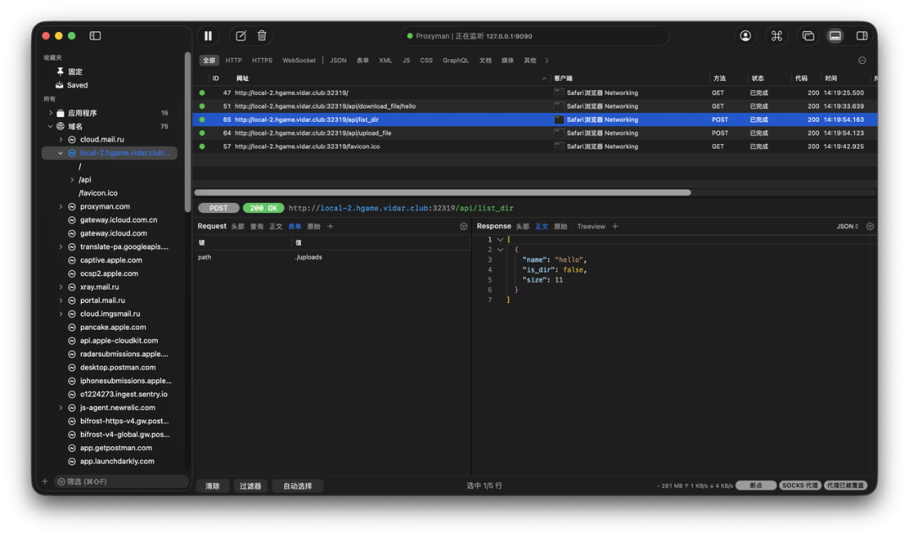

继续枚举目录，发现 `./update/easyuu.zip`，拼接下载链接后拿到源码。

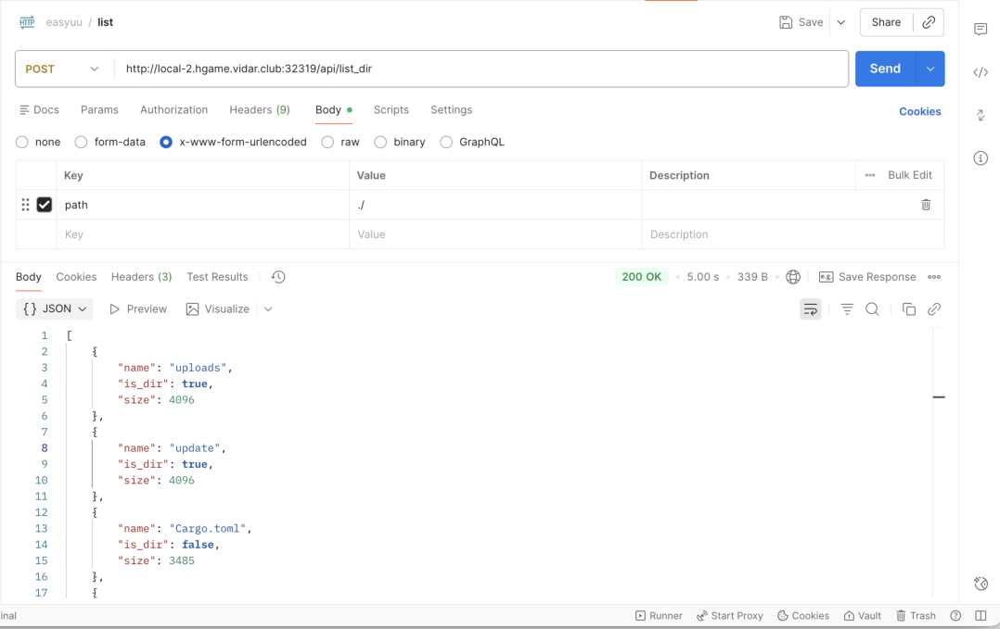

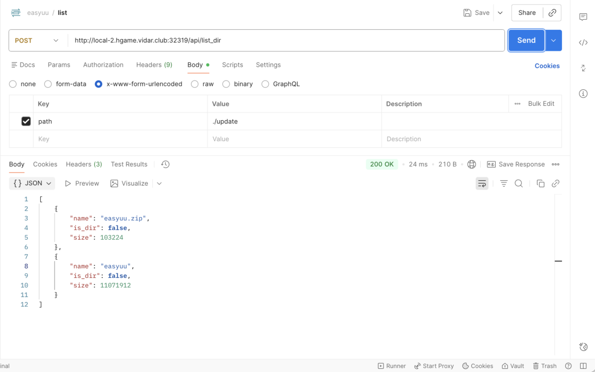

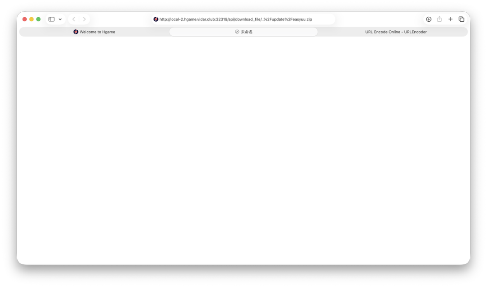

分析源码后可以看到两个决定性机制：上传接口存在 `path1` 后门，可以控制最终保存路径；服务有自更新逻辑，会比较当前程序和 `./update/easyuu` 的版本号。

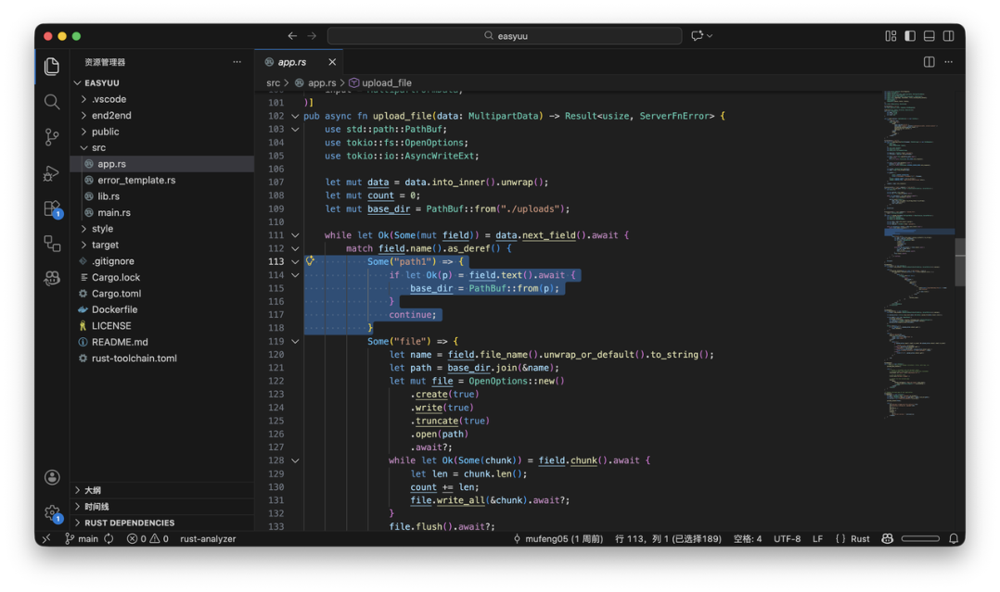

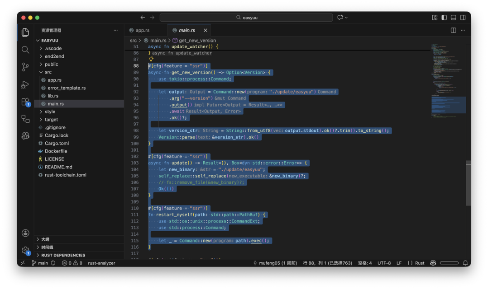

源码目录里还保留了 `.git`。查看提交记录可以找到曾经直接打印 flag 的 commit，说明修改程序后触发自更新是预期方向。

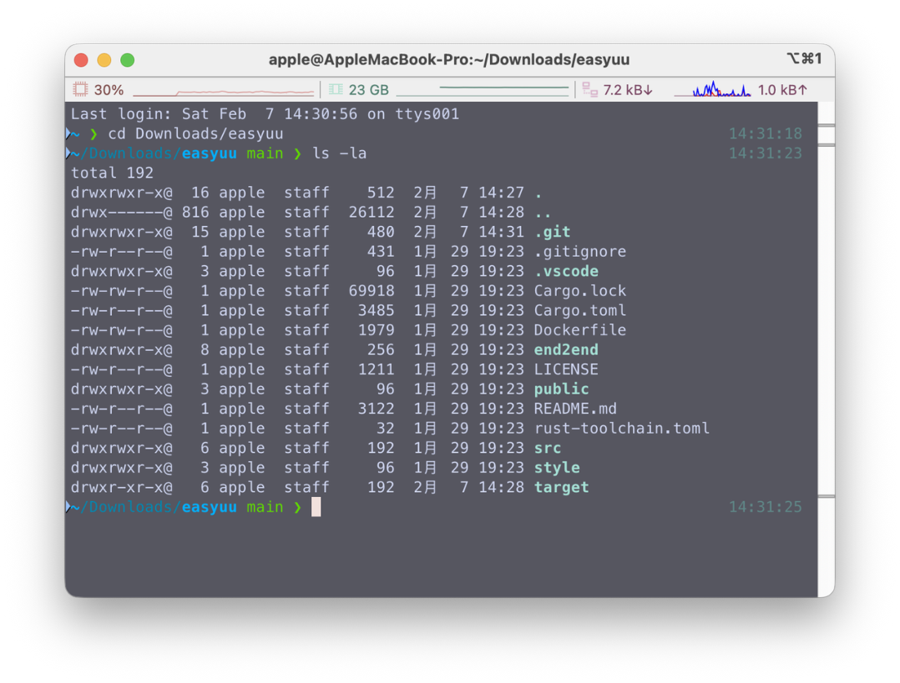

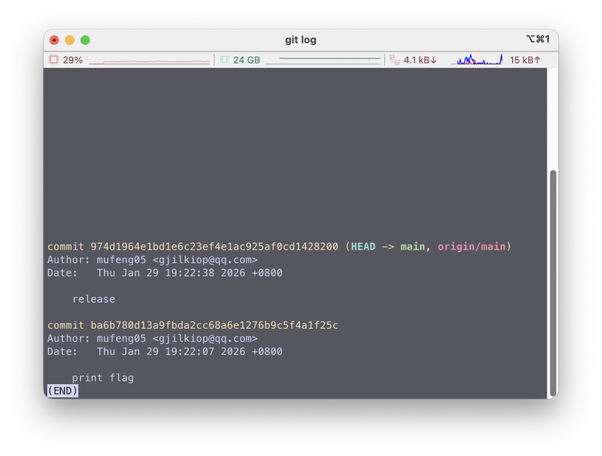

之后修改源码中的版本号，使新编译程序版本高于当前服务版本，并把需要执行的逻辑写入程序中重新编译。

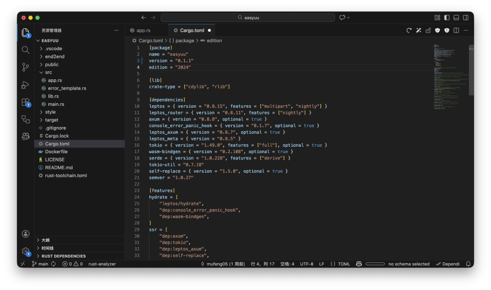

最后利用 `path1` 将新程序上传到 `./update/easyuu`，等待服务的自更新逻辑触发。更新完成后，新程序被服务加载执行，即可得到 flag。

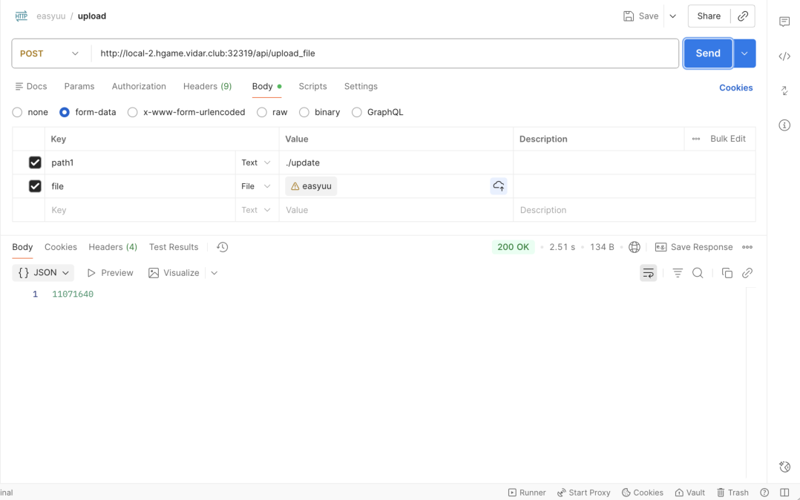

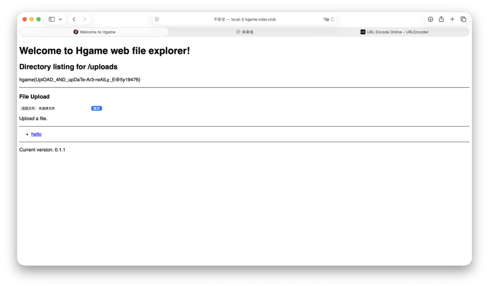

## 方法总结

- 核心技巧：目录遍历读取更新包，利用上传后门覆盖更新文件，再借自更新机制执行自定义程序。
- 识别信号：Web 服务同时出现可控路径列表、源码包、版本号比较和自更新目录时，要优先检查能否投放更新文件。
- 复用要点：这类题不要只盯 RCE payload，源码中的运维功能、后门参数、`.git` 历史提交往往就是主线。
