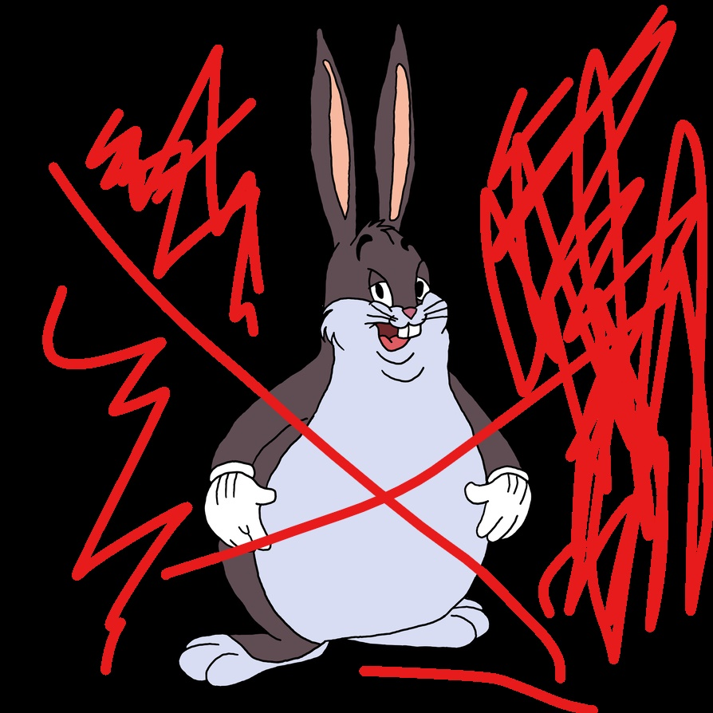
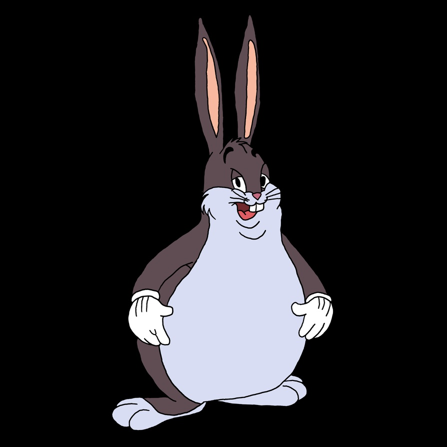

# UMDCTF2022 ChungusBot v2 Writeup

## 题目简述

题目要求审计 Discord Bot 源码并通过私信命令触发 flag。当前 UMDCTF 题库目录只保留题面和 flag，但组织方的 [ChungusBot v2 源码仓库](https://github.com/UMD-CSEC/ChungusBot_v2)仍可访问。

核心有两道校验：用户头像经二值化后必须与服务端目标图达到超过 92% 的逐像素相似度；消息创建时间的秒数必须落在两个窄区间之一。决定性机制是远程 Bot 的输入校验与命令流程，归入 `web`。

## 解题过程

私信命令前缀末尾包含一个空格；下方用 `␠` 显示该空格：

```text
Oh Lord Chungus please␠
```

隐藏子命令 `tellme avatar` 会返回一张带大量红色涂画的提示图：



服务端实际使用 `chungus_changed.jpg` 作为比较目标：



`check1` 将两张图都执行 `Image.convert("1")`，再按线性像素序列计数相等位置，条件为：

$$
\frac{\text{相同像素数}}{\text{目标图像素总数}}>0.92
$$

因此不必逐像素重画目标。提示图的大面积背景原本就是黑色，只需把红色干扰线尽量涂成同样的黑色并保持尺寸，即可让二值化后的相同比例超过 92%，然后把编辑结果设为 Discord 头像。

第二道校验的源码为：

```python
something = int(str(ctx.created_at).split(":")[-1].split(".")[0])
if (something > 45 and something < 50) or \
   (something > 14 and something < 19):
    return True
```

它解析的是消息时间的“秒”，有效值为 `15..18` 或 `46..49`。这不是图片元数据，也不是分钟。设置头像后，在私信中于这些秒数发送白名单命令，例如：

```text
Oh Lord Chungus please tellme theflag
```

两项检查同时通过后得到：

```text
UMDCTF{Chungus_15_wh0_w3_str1v3_t0_b3c0m3}
```

## 方法总结

源码优先级高于第三方复盘。本题常见误解是把时间窗口说成“分钟”或图片创建时间，但 `ctx.created_at` 和字符串切分明确表明它检查消息秒数。图像比较也不是感知哈希，而是二值化后的逐位置相等率；理解分母、阈值和大面积黑色背景后，就能用很少的编辑达到条件。
